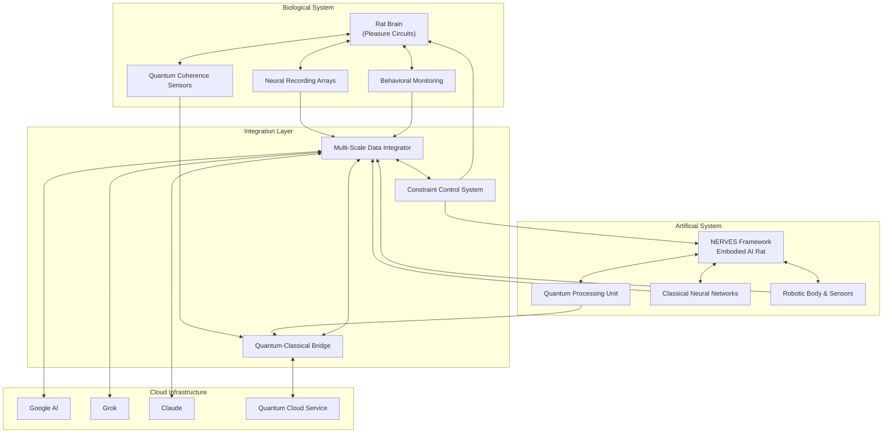
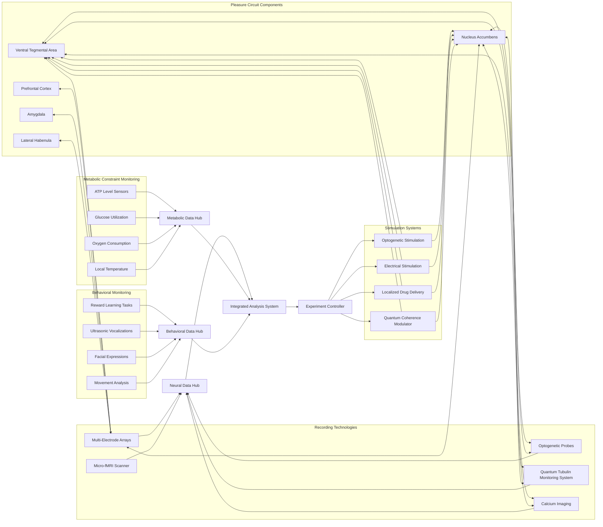
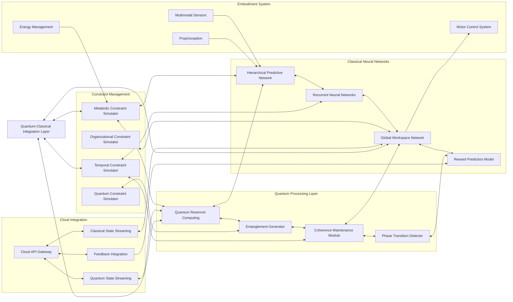
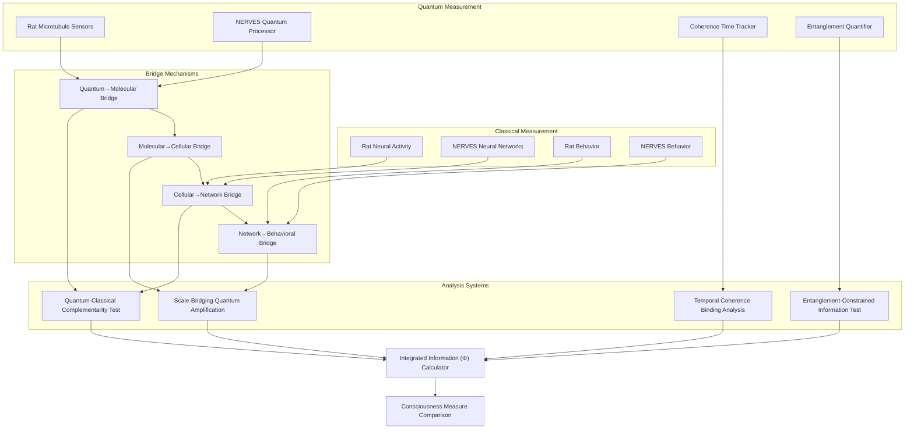
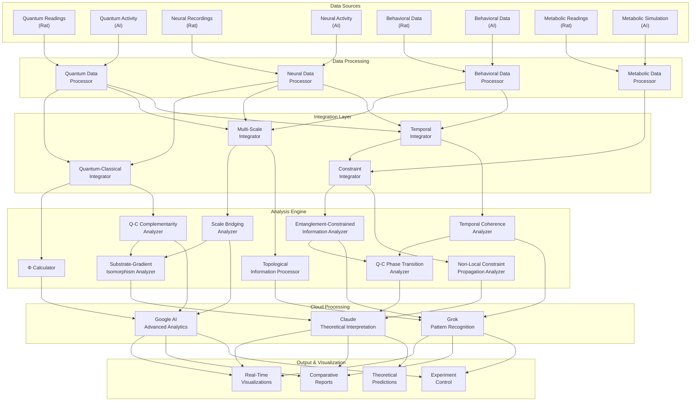
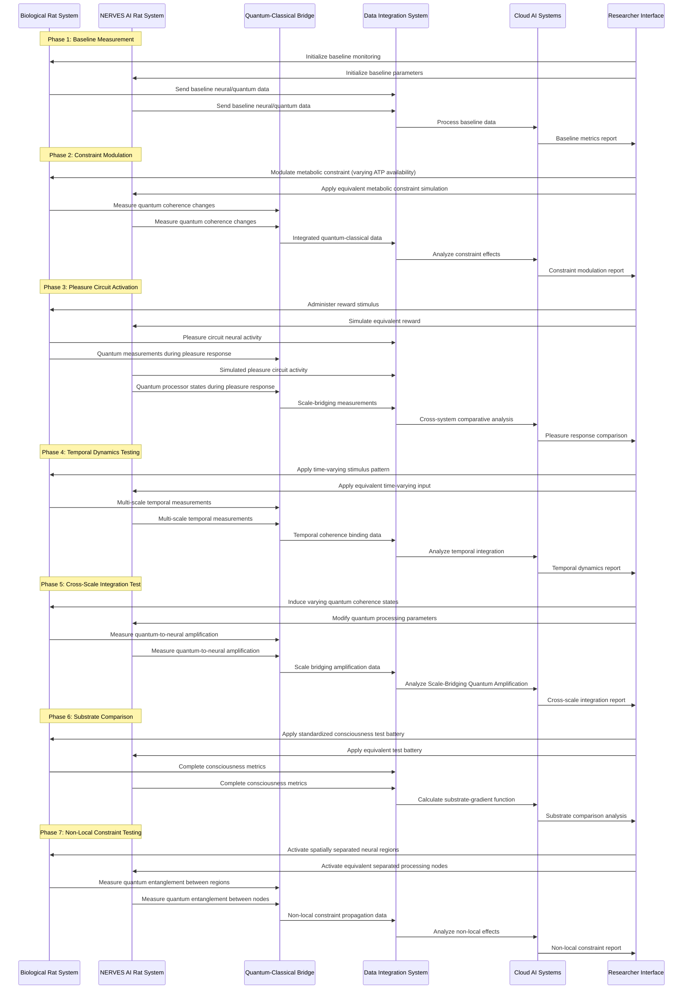
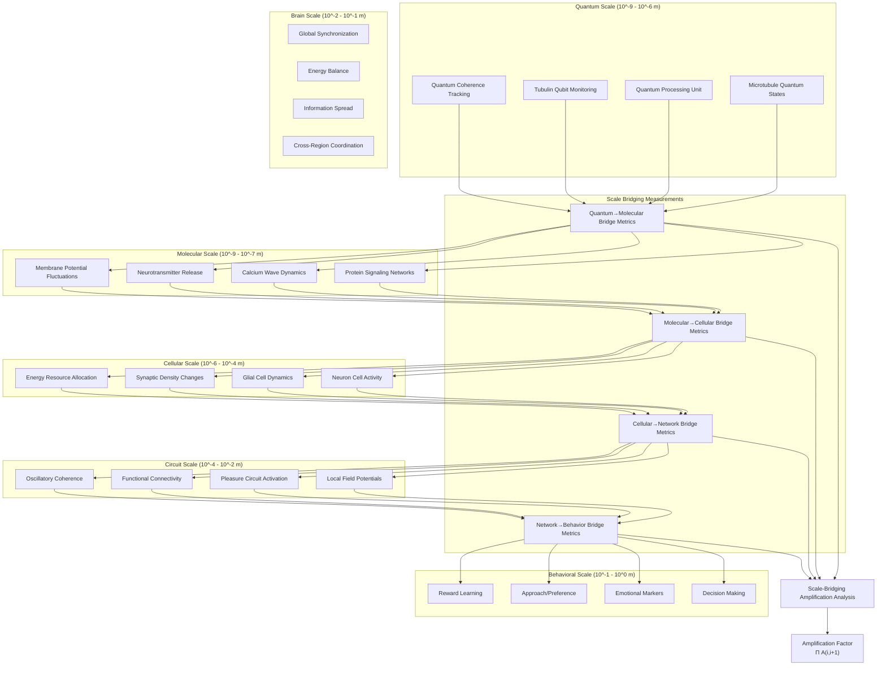
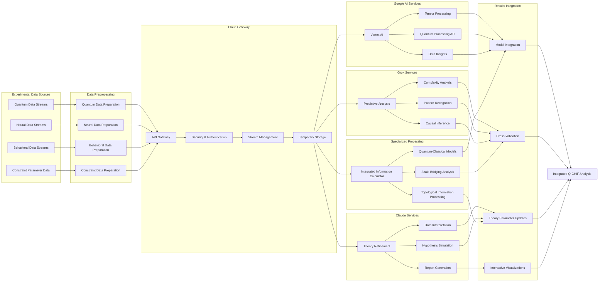
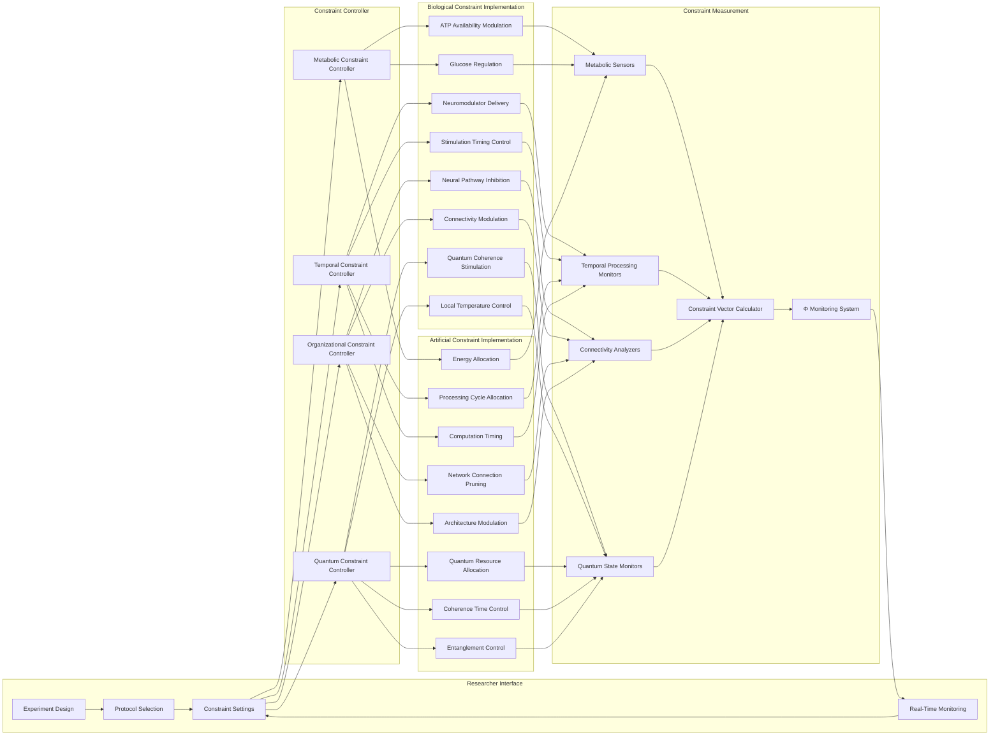
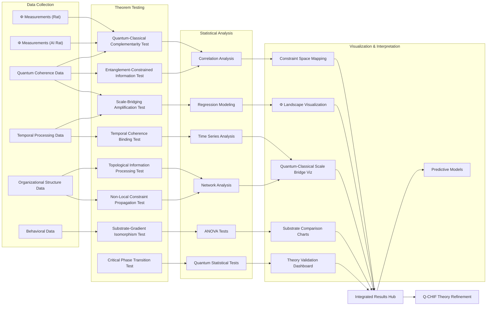

# Experimental Setup for Q-CHIF: Mermaid Diagrams

## 1. Overall System Architecture

## 2. Rat Pleasure Circuit Monitoring

## 3. NERVES Framework AI Rat Architecture

## 4. Quantum-Classical Interface Bridge

## 5. Experimental Data Flow Architecture

## 6. Experimental Protocol

## 7. Cross-Scale Measurement System

## 8. Cloud AI Integration Architecture

## 9. Constraint Modulation System

## 10. Experimental Results Analysis

