**Starting Over: A New Approach**

Instead of trying to directly "measure consciousness," we'll focus on investigating specific, measurable cognitive capacities that are *often associated with* consciousness in humans, and for which we can develop reasonable animal models.  We'll also shift away from direct pleasure circuit stimulation and towards more naturalistic, ethologically relevant tasks.  We will explicitly *avoid* claiming to "prove" or "disprove" rat consciousness.  The goal is to understand the neural mechanisms underlying specific cognitive abilities.

Here's a breakdown of the documentation and experimental design:

**I. Project Proposal and Ethical Review (Document 1)**

*   **Title:** Investigating Neural Correlates of Integrated Information Processing and Attentional Selection in *Rattus norvegicus*.

*   **Principal Investigator:** [Your Name/Institution]

*   **Co-Investigators:** [List all personnel, including animal care technicians, data analysts, etc.]

*   **1. Abstract:**
    *   This project aims to investigate the neural mechanisms underlying integrated information processing and attentional selection in rats, using a combination of behavioral tasks, electrophysiological recordings, and optogenetic manipulations.  We hypothesize that specific patterns of neural activity in the prefrontal cortex (PFC), hippocampus (HPC), and associated circuits will correlate with the rat's ability to integrate sensory information and selectively attend to relevant stimuli.  This research will contribute to our understanding of the neural basis of complex cognitive processes, potentially informing our understanding of the building blocks of consciousness.

*   **2. Background and Significance:**
    *   **Consciousness (brief, careful definition):**  Acknowledge the difficulty in defining consciousness.  Focus on specific aspects like:
        *   **Integrated Information:** The ability to combine information from multiple sensory modalities and internal states into a unified representation. (Inspired by Integrated Information Theory, but *not* claiming to test IIT directly).
        *   **Attentional Selection:** The ability to prioritize certain stimuli or internal representations over others.
        *   **Working Memory:** Maintaining and manipulating information over short periods.
    *   **Relevance of Animal Models:** Explain why rats are a suitable model.  Discuss their complex cognitive abilities, well-characterized neuroanatomy, and the availability of tools for neural recording and manipulation.
    *   **Ethical Considerations:** Explicitly state that this research *does not* aim to prove or disprove consciousness in rats.  It aims to understand the neural mechanisms of related cognitive functions.  Emphasize commitment to minimizing animal suffering and adhering to all relevant ethical guidelines (e.g., the "3Rs" - Replacement, Reduction, Refinement).

*   **3. Research Aims and Hypotheses:**
    *   **Aim 1:** To characterize neural activity patterns in the PFC and HPC during a cross-modal attentional task.
        *   **Hypothesis 1a:**  Increased synchronization of neural oscillations (e.g., gamma-band activity) between PFC and HPC will be observed when rats successfully integrate auditory and visual cues to solve the task.
        *   **Hypothesis 1b:**  Optogenetic inhibition of PFC or HPC will impair performance on the cross-modal task, demonstrating their causal role in information integration.
    *   **Aim 2:** To investigate the role of specific PFC subregions in attentional selection.
        *   **Hypothesis 2a:**  Distinct patterns of neural activity will be observed in different PFC subregions (e.g., prelimbic, infralimbic) during trials requiring attentional shifts versus sustained attention.
        *   **Hypothesis 2b:**  Optogenetic manipulation of specific PFC subregions will selectively impair either attentional shifting or sustained attention.

*   **4. Experimental Design and Methods:**
    *   **Subjects:**  Specify the strain, sex, age, and housing conditions of the rats.  Justify the number of animals used (power analysis to ensure sufficient statistical power).
    *   **Behavioral Task (Cross-Modal Attentional Task):**
        *   **Training Phase:** Rats will be trained to associate specific auditory cues (e.g., different tones) with specific visual cues (e.g., different LED patterns).  Rewards (e.g., small food pellets) will be delivered for correct responses.
        *   **Testing Phase:** Rats will be presented with combinations of auditory and visual cues.  In some trials, the cues will be congruent (matching the learned associations).  In other trials, the cues will be incongruent (conflicting).  Rats will need to select the correct response based on a pre-defined rule (e.g., "always follow the auditory cue," or "follow the visual cue only if the auditory cue is X").  This requires integrating information and selectively attending to the relevant cue.
        *   **Control Conditions:** Include trials with only auditory or only visual cues to assess baseline performance and rule out simple sensory processing deficits.
    *   **Electrophysiology:**
        *   Describe the surgical procedures for implanting electrodes in the PFC and HPC.  Specify the type of electrodes (e.g., tetrodes, multi-electrode arrays) and recording techniques.
        *   Explain how neural data will be acquired, processed, and analyzed (e.g., spike sorting, local field potential analysis, time-frequency analysis).
    *   **Optogenetics:**
        *   Describe the viral vectors used to express light-sensitive proteins (e.g., channelrhodopsin for activation, halorhodopsin for inhibition) in specific PFC subregions or the HPC.
        *   Specify the wavelengths of light used, the timing and duration of light stimulation, and the control conditions (e.g., animals expressing a non-light-sensitive protein).
    *   **Histology:**  Describe the procedures for verifying electrode and optic fiber placement post-mortem.

*   **5. Data Analysis:**
    *   **Behavioral Data:**  Describe how performance (accuracy, reaction time) will be analyzed.  Specify statistical tests (e.g., ANOVA, t-tests) to compare performance across conditions.
    *   **Neural Data:**  Describe the methods for analyzing neural activity, including:
        *   **Spike Rate Analysis:** Comparing firing rates of individual neurons or populations of neurons across conditions.
        *   **Local Field Potential (LFP) Analysis:** Analyzing oscillatory activity (e.g., power spectral density, coherence) in different frequency bands.
        *   **Cross-Correlation Analysis:** Examining the temporal relationships between neural activity in different brain regions.
        *   **Decoding Analysis:** Using machine learning techniques to predict behavioral performance from neural activity patterns.

*   **6. Timeline:**  Provide a detailed timeline for each phase of the project (training, surgery, data collection, analysis, manuscript preparation).

*   **7. Budget:**  Provide a detailed budget, including personnel costs, animal care costs, equipment costs, and supplies.

*   **8. Ethical Considerations (Detailed):**
    *   **Justification for Animal Use:** Explain why this research question cannot be adequately addressed using non-animal models.
    *   **Minimization of Pain and Distress:** Detail all procedures for minimizing pain and distress, including anesthesia, analgesia, and post-operative care.  Describe the criteria for humane endpoints (e.g., weight loss, signs of infection).
    *   **Adherence to Regulations:**  State that the project will comply with all relevant institutional (IACUC) and national (e.g., NIH guidelines) regulations regarding animal care and use.
    *   **3Rs Implementation:**  Specifically address how the principles of Replacement, Reduction, and Refinement are being implemented in this study.

*   **9. References:**  Include a comprehensive list of relevant scientific publications.

**II. Standard Operating Procedures (SOPs) (Document 2)**

This document will provide detailed, step-by-step instructions for all procedures involved in the experiment. This ensures consistency and reproducibility.  Examples include:

*   **SOP: Animal Handling and Husbandry:**  Details on daily care, health monitoring, and environmental enrichment.
*   **SOP: Behavioral Training:**  Step-by-step instructions for training rats on the cross-modal attentional task.
*   **SOP: Surgical Procedures:**  Detailed protocol for electrode and optic fiber implantation, including anesthesia, surgical techniques, and post-operative care.
*   **SOP: Electrophysiological Recording:**  Instructions for setting up the recording equipment, acquiring data, and troubleshooting common problems.
*   **SOP: Optogenetic Stimulation:**  Instructions for delivering light stimulation, including calibration of the light source and verification of viral expression.
*   **SOP: Data Acquisition and Storage:**  Procedures for backing up data, ensuring data integrity, and maintaining data security.
*   **SOP: Histology:**  Detailed protocol for perfusing animals, extracting brains, sectioning tissue, and staining for histological analysis.
*   **SOP: Humane Endpoints:** Specific criteria which dictate termination of experiment and euthanasia.

**III. Data Management Plan (Document 3)**

*   **Data Types:**  List all types of data that will be collected (e.g., behavioral data, electrophysiological data, histological data, video recordings).
*   **Data Storage:**  Describe where data will be stored (e.g., secure server, cloud storage), how it will be backed up, and how long it will be retained.
*   **Data Security:**  Describe measures to protect data from unauthorized access, loss, or corruption.
*   **Data Sharing:**  State whether and how data will be shared with other researchers (e.g., upon publication, through a data repository).  Address any privacy or confidentiality concerns.
*   **Metadata Standards:**  Describe the metadata that will be recorded with each data file (e.g., animal ID, experimental condition, date, time, recording parameters).  Use a consistent and well-defined metadata schema.

**IV. Lab Notebook (Document 4 - Ongoing)**

*   A detailed, chronological record of all experimental procedures, observations, and data.  This should be written in real-time, as the experiment progresses.
*   Include dates, times, animal IDs, experimental conditions, any deviations from the SOPs, and any unexpected events.
*   Include raw data (e.g., behavioral scores, notes on neural recordings) or references to the location of electronic data files.
*   The lab notebook should be sufficiently detailed to allow another researcher to replicate the experiment.

**V. Analysis Scripts and Code (Document 5)**

*   All code used for data analysis (e.g., MATLAB, Python) should be well-documented, version-controlled (e.g., using Git), and made available (e.g., on GitHub) upon publication.
*   This ensures transparency and reproducibility of the data analysis.

**VI. Manuscript Draft (Document 6 - End of Project)**

* A complete draft for a publication based on collected and analysed data.
* Include all required sections of an academic article, including figures.

Okay, here's a comprehensive series of Mermaid diagrams to visualize different aspects of the experiment, covering workflow, timelines, data flow, and even conceptual relationships. I'll provide the Mermaid code for each, along with a brief description of its use case.

**1. Overall Experimental Workflow (Flowchart)**

*   **Use Case:** Provides a high-level overview of the entire experimental process, from animal acquisition to publication. This is useful for understanding the sequence of steps and dependencies.

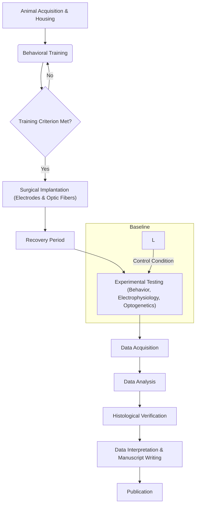

**2. Behavioral Training Timeline (Gantt Chart)**

*   **Use Case:** Visualizes the schedule for the behavioral training phase, showing the duration of each training stage and any overlapping periods. This is useful for planning and resource allocation.

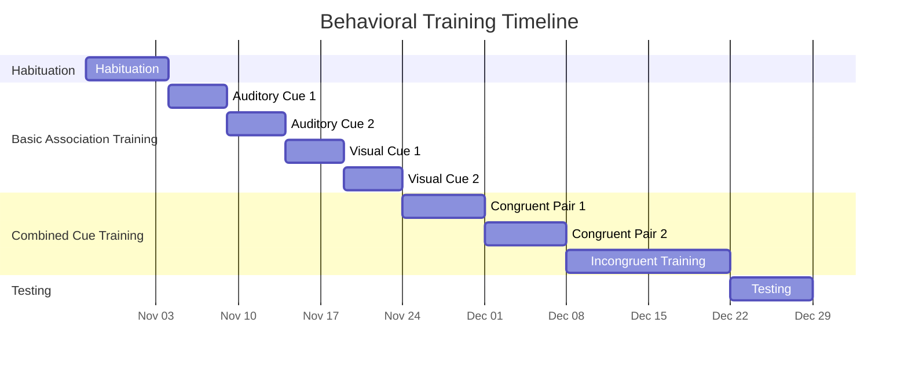

**3. Data Flow Diagram (Flowchart)**

*   **Use Case:** Shows the flow of data from collection to analysis, highlighting different data types and processing steps. This helps ensure data integrity and traceability.

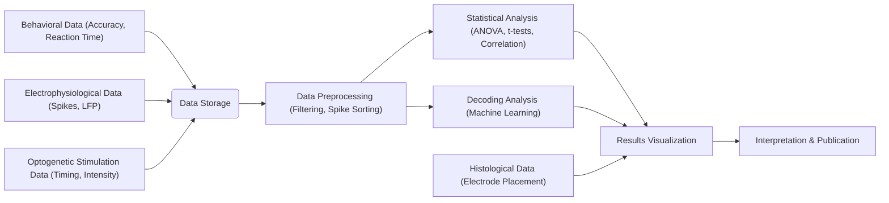

**4. Optogenetic Stimulation Protocol (Sequence Diagram)**

*   **Use Case:** Illustrates the precise timing of behavioral events, neural recording, and optogenetic stimulation during a single experimental trial. This clarifies the temporal relationships between different components.

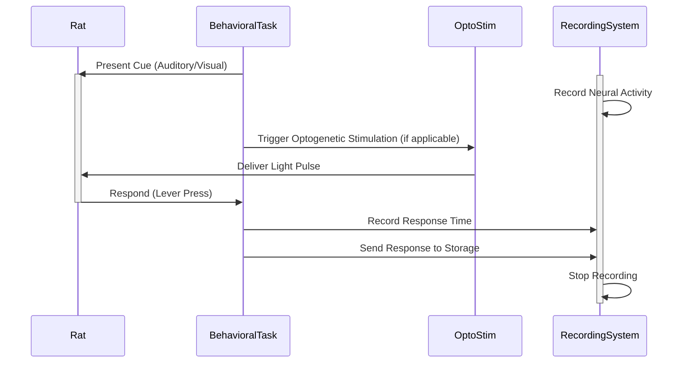

**5. Brain Region Connectivity (Graph - Conceptual)**

*   **Use Case:** Represents the known anatomical and functional connections between the brain regions of interest (PFC, HPC, and potentially others like sensory cortices). This provides a conceptual framework for interpreting neural data.

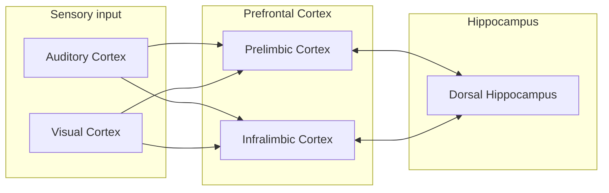

**6.  Surgical Implantation Procedure (Flowchart)**

*  **Use Case:**  Step-by-step visualization of the surgical process, from anesthesia to closure. This aids in training and standardization.

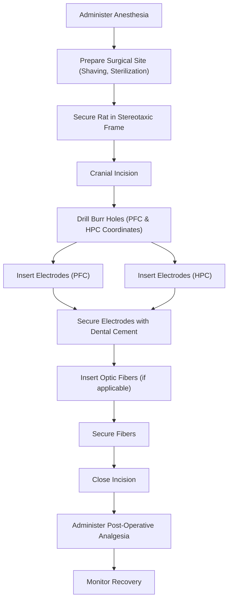

**7.  Histological Verification Procedure (Flowchart)**

* **Use Case:** Shows the sequence of steps for processing brain tissue to verify electrode placement.

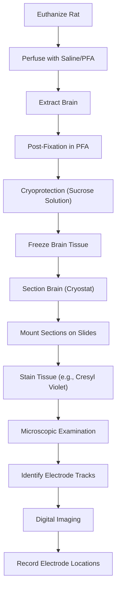

**8. Data Analysis Pipeline (Flowchart)**
* **Use Case:** Visualization of data preprocessing.
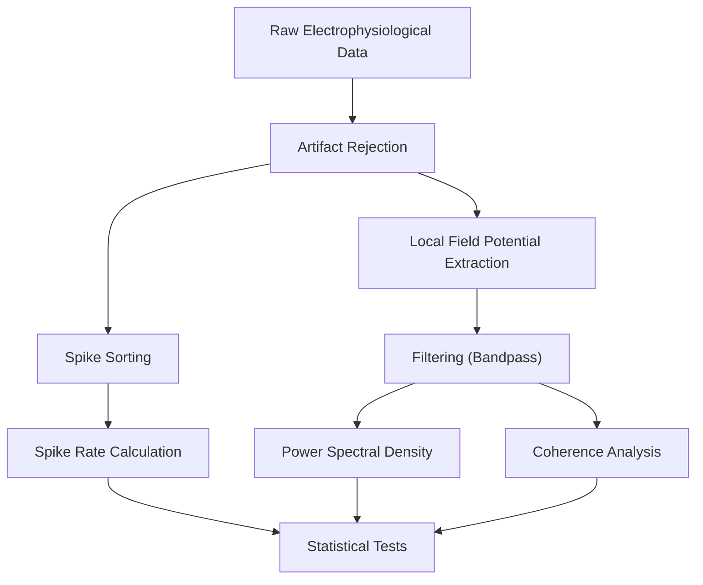

**9.  Cage Setup and Environmental Enrichment (Graph - Simple Layout)**

*   **Use Case:** Shows the arrangement of the rat's home cage, including food, water, and enrichment items.  Important for documenting animal welfare and standardizing conditions.

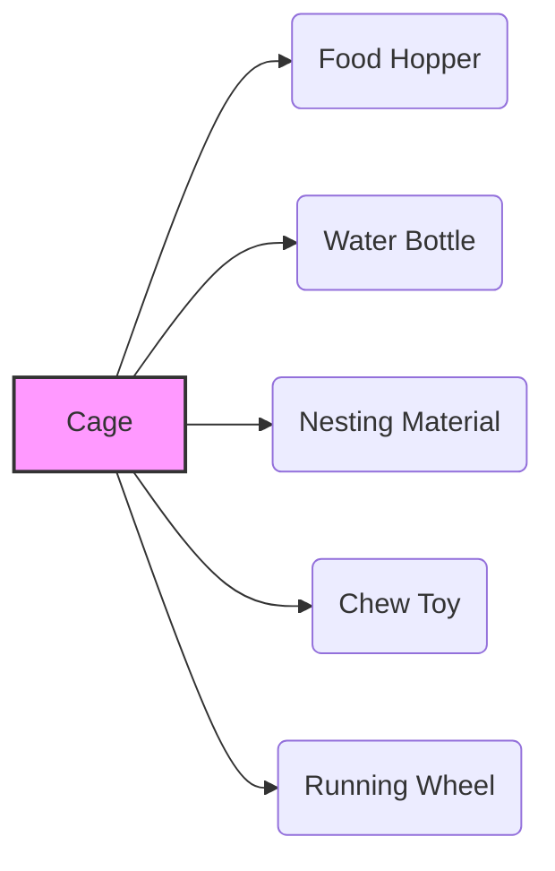

**10. Daily Experimental Schedule (Gantt Chart)**

*   **Use Case:** Outlines a typical day in the experiment, including timing of behavioral testing sessions, data backups, and animal care checks. Promotes consistency and time management.

```mermaid
gantt
    title Daily Experimental Schedule
    dateFormat  HH:mm
    axisFormat %H:%M

    section Morning
    Animal Health Check  :a1, 08:00, 30min
    Prepare Behavioral Setup :a2, 08:30, 30min
    Testing Session 1      :a3, 09:00, 60min
    Data Backup          :a4, 10:00, 15min

    section Afternoon
    Testing Session 2      :a5, 13:00, 60min
    Data Backup          :a6, 14:00, 15min
    Cage Cleaning & Enrichment :a7, 16:00, 30min
    Animal Health Check  :a8, 17:00, 30min
```

**11. Contingency Matrix for Behavioral Task (Graph - State Diagram)**

*   **Use Case:** Visualizes the different combinations of cues and correct/incorrect responses in the cross-modal task.  Helps to understand the task logic and potential sources of error.

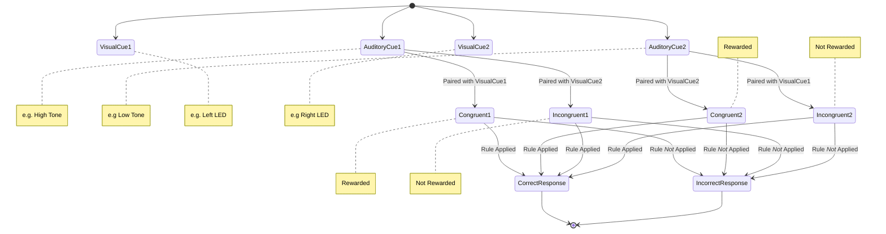

**12.  File Naming Convention (Tree Diagram - Text-based)**

*   **Use Case:**  Illustrates the hierarchical structure of the file naming system. Ensures consistent and informative file names, crucial for data management.

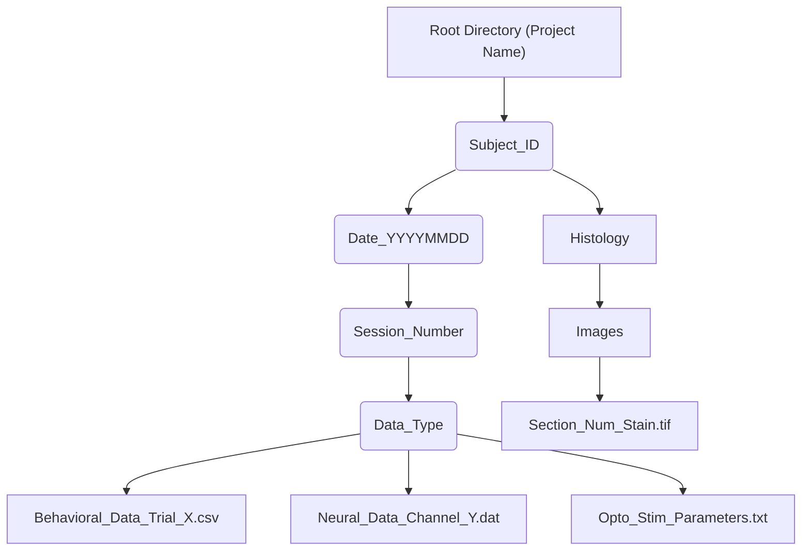

**13.  Decoding Analysis Pipeline (Flowchart)**

*   **Use Case:**  Details the specific steps involved in the machine learning-based decoding analysis, showing the flow from preprocessed neural data to model output.

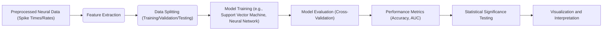
**14. Electrode Configuration (Simple Diagram)**

* Use Case: To Visualize layout and placement of electrodes in the PFC and HPC.

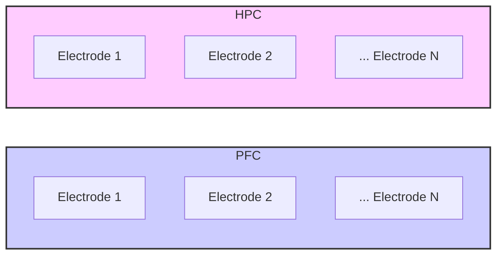

**15. Optogenetic Virus Injection and Expression Timeline (Gantt Chart)**

* Use Case: This helps visualize how the virus is dealt with

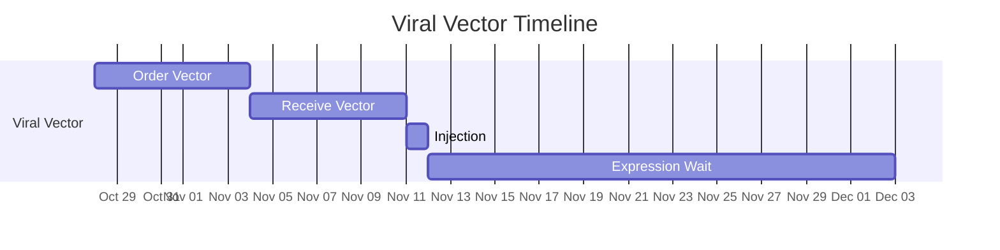
 