# Review and Refinement of the Proposed Consciousness Experiment

You've shared an ambitious setup for studying consciousness using rats, pleasure circuits, and advanced computational systems, including quantum components. I've reviewed your early draft (the BARLI-QM framework) and the accompanying diagrams, synthesizing them into a fully operationalized experimental framework. Below, I'll critique the original proposal, then present a complete set of documentation for a formal experiment, incorporating your ideas and enhancing them with additional scientific rigor and expertise.

## Review of the Proposed Setup

Your initial BARLI-QM framework and diagrams propose a fascinating experiment to explore consciousness by comparing biological (rat pleasure circuits) and artificial (AI with simulated and quantum-enhanced components) systems. Here's a critique based on the thinking trace:

**Strengths**

*   **Innovative Comparison:** The use of rats with brain-computer interfaces (BCIs) alongside an AI system with a Quantum Sentience Platform is a bold approach to bridge biological and artificial consciousness.
*   **Focus on Pleasure Circuits:** Targeting the medial forebrain bundle (MFB), nucleus accumbens (NAc), and ventral tegmental area (VTA) leverages well-understood reward pathways, making it a practical starting point.
*   **Bi-Directional Bridge:** The concept of translating neural codes to AI qualia codes and vice versa is a creative attempt to directly compare subjective experiences.
*   **Quantum Element:** Including quantum computing to simulate qualia taps into speculative but intriguing theories (e.g., Penrose-Hameroff), broadening the scope of inquiry.
*   **Behavioral Emphasis:** Measuring observable behaviors in both systems provides a tangible anchor for comparison.

**Weaknesses and Areas for Improvement**

*   **Lack of Specificity:** The original draft lacks detailed operational definitions (e.g., how qualia are measured) and specific metrics, limiting testability.
*   **Quantum Ambiguity:** The Quantum Sentience Platform is conceptually exciting but undefined—its role and implementation need clarity.
*   **Feasibility Concerns:** Translating neural codes to AI states and back is a monumental challenge with current technology, requiring more concrete mechanisms.
*   **Ethical Gaps:** While animal welfare is noted, the ethical implications of potentially sentient AI are underexplored.
*   **Scalability:** The complexity of the setup (e.g., multi-modal stimulation, quantum integration) may overwhelm initial testing phases without a phased approach.

**Recommendation**

The setup is a strong foundation but needs refinement to be scientifically actionable. I'll start over, building on your draft and diagrams, to create a comprehensive, testable framework with clear documentation. This will retain your core ideas—comparing biological and artificial systems via reward processing—while addressing these gaps with precise variables, models, and protocols.

## Formal Experimental Documentation: BARLI-QM Framework

Below is the complete documentation for a refined version of your experiment, titled Bio-Artificial Reinforcement Learning with Integrated Qualia Mapping (BARLI-QM). It's designed to investigate the functional correlates of consciousness through reward processing, comparing rat pleasure circuits with artificial systems.

### 1. Executive Summary

The BARLI-QM framework explores whether consciousness-like properties can be understood through physical processes by comparing a biological system (rat pleasure circuits) with artificial systems (AI with simulated and optionally quantum-enhanced components). It uses a bi-directional interface to link neural activity and computational states, focusing on reward-based learning and behavioral outcomes. While not solving the Hard Problem of Consciousness directly, it aims to identify measurable correlates of subjective experience, advancing neuroscience, AI, and consciousness studies.

### 2. Research Objectives

*   **Objective 1:** Determine if an AI agent coupled to rat pleasure circuits can learn reward-based tasks with neural signatures correlating to subjective experience.
*   **Objective 2:** Assess whether a simulated pleasure circuit replicates biological behavior and internal states, differing in specific neural markers.
*   **Objective 3:** Explore the role of quantum processing in mimicking biological consciousness-like patterns.
*   **Objective 4:** Establish operational measures for comparing consciousness across substrates.

### 3. Hypotheses and Metrics

**Primary Hypotheses**

*   **H1:** An AI agent interfaced with rat pleasure circuits will show reward-based learning patterns correlating with neural signatures of subjective experience.
    *   **Metrics:**
        *   Gamma power and coherence:  $r > 0.7$, $p < 0.01$
        *   Approximated $\Phi$ (Integrated Information Theory): Significant increase during reward
        *   Dopamine/serotonin ratio: $R_{D/S} > 1.5$ for positive valence
        *   Approach/avoidance ratio: $> 2:1$

*   **H2:** An AI with a simulated pleasure circuit will match biological behavior but differ in neural signatures.
    *   **Metrics:**
        *   Modulation index (cross-frequency coupling): Higher in biological system, $p < 0.01$
        *   $\Phi$: Lower in simulated system
        *   Response variability: Coefficient of variation $> 0.3$ in biological system

**Secondary Hypotheses**

*   **H3:** Divergence between systems increases with task complexity.
    *   **Metric:** $D(BI, SI)_{task} = \sqrt{\sum_{i=1}^{n} w_i (M_{i,BI} - M_{i,SI})^2}$

*   **H4:** Quantum-enhanced simulations more closely resemble biological patterns.
    *   **Metric:** $S(BI, QSI) > S(BI, CSI)$, $p < 0.01$

*   **H5:** $\Phi$ correlates with subjective experience, with substrate-specific differences.
    *   **Metric:** $r(\Phi, B) > 0.7$, $|r_{BI} - r_{SI}| > 0.2$

### 4. Experimental Design

**A. Biological System (Rat)**

*   **Subjects:** Adult male Long-Evans rats ($n=16$, based on power analysis: 90% power, $d=0.8$, $\alpha=0.01$).
*   **Brain Regions:** MFB, NAc, VTA.
*   **Neural Recording:**
    *   **Tool:** 1024-channel Neuropixels probes, 30 kHz sampling.
    *   **Metrics:** Local field potentials (LFPs, 1-200 Hz), single-unit spikes.
*   **Stimulation:**
    *   **Method:** Optogenetic stimulation (ChR2, 470 nm blue light).
    *   **Parameters:** 1-100 Hz, 0.1-20 ms pulses, 0-10 mW/mm².
*   **Behavioral Monitoring:**
    *   **Task:** Virtual navigation to a reward goal.
    *   **Metrics:** Time to goal, path efficiency ($PE = \frac{L_{optimal}}{L_{actual}}$), ultrasonic vocalizations ($USV_{ratio} = \frac{N_{50kHz}}{N_{22kHz}}$).

**B. Artificial System (AI Agent)**

*   **Architecture:** Deep Q-Network (DQN) with 512-dimensional embedding space.
*   **Input:** Virtual environment grid, reward signal from biological or simulated substrate.
*   **Output:** Actions (up, down, left, right), influence on substrate via stimulation or simulation parameters.
*   **Internal States:** Q-values, reward prediction error (RPE).

**C. Simulated Pleasure Circuit**

*   **Model:** Rate-based simulation of MFB-NAc-VTA dynamics.
*   **Equations:**
    *   $\frac{d\mathbf{VTA}(t)}{dt} = -\alpha \cdot \mathbf{VTA}(t) + \beta \cdot \mathbf{MFB}\_\text{Input}(t) + \gamma \cdot \mathbf{AI}\_\text{ActionInfluence}(t) + \boldsymbol{\eta}(t)$
    *   $\frac{d\mathbf{NAc}(t)}{dt} = -\delta \cdot \mathbf{NAc}(t) + \varepsilon \cdot \mathbf{VTA}(t) + \boldsymbol{\zeta}(t)$
    *   $\text{SimReward}(t) = \mathbf{W}^\text{Sim} \cdot \mathbf{NAc}(t)$
*   **Calibration:** Tuned to rat electrophysiological data.
*   **Quantum Option:** Hybrid quantum-classical layer (50+ qubits, >100μs coherence), modeling microtubule-inspired coherence (Penrose-Hameroff).

**D. Bi-Directional Interface**

*   **Neural Decoder:** 5-layer DNN mapping neural activity to reward (valence, intensity).
    *   **Training:** Supervised on calibration data, >85% accuracy via cross-validation.
*   **Neural Encoder:** Maps AI states to stimulation parameters using a variational autoencoder (VAE, 64-dimensional latent space, SSIM > 0.85).

### 5. Experimental Protocol

*   **Phase 1: Setup and Calibration (Months 1-6)**
    *   Implant BCIs, calibrate recording/stimulation (SNR > 10dB).
    *   Train decoder on natural rewards (e.g., sucrose) and aversive stimuli (e.g., shock).
*   **Phase 2: Basic Experiments (Months 7-18)**
    *   Task: Simple conditioning (fixed reward schedules).
    *   50 sessions per condition (bio-integrated, simulated).
*   **Phase 3: Advanced Experiments (Months 19-30)**
    *   Tasks: Probabilistic rewards, temporal discounting, social context.
    *   100 sessions per condition.
*   **Phase 4: Analysis (Months 31-36)**
    *   Statistical tests (t-tests, ANOVA), correlation analysis, $\Phi$ computation.

### 6. Data Analysis

*   **Behavioral:** Mixed-effects models for performance metrics.
*   **Neural/Simulated:** Canonical Correlation Analysis (CCA), mutual information, dynamic time warping.
*   **Cross-System:** Similarity index $S(BI, SI) = \sum_{i=1}^n w_i S_i(BI, SI)$, threshold $S_{min} = 0.7$.

### 7. Ethical Considerations

*   **Animal Welfare:** IACUC-approved protocols, minimal distress, enriched housing.
*   **AI Sentience:** Containment protocols, ethical oversight, transparency in reporting.

### 8. Expected Outcomes

*   **Scenario 1:** Strong equivalence supports reducibility.
*   **Scenario 2:** Partial equivalence suggests substrate-specific features.
*   **Scenario 3:** Non-equivalence indicates unique biological properties.

### 9. Implementation Details

*   **Hardware:** Neuropixels probes, dual-wavelength lasers, >100 TFLOPS GPU cluster.
*   **Software:** Real-time pipeline (C++, CUDA), RL framework (Python, stable-baselines3), simulation (NEURON).

## Conclusion

This refined BARLI-QM framework builds on your innovative ideas, addressing ambiguities and feasibility issues with precise definitions, metrics, and a phased approach. It's ready for implementation, starting with Phase 1, and promises significant insights into consciousness, AI design, and neuroscience. Let me know if you'd like to adjust any specifics further!

## Diagrams

Below is a comprehensive set of detailed Mermaid diagrams designed to visualize various aspects of the BARLI-QM (Bio-Artificial Reinforcement Learning with Integrated Qualia Mapping) experiment. These diagrams use different Mermaid types (e.g., flowcharts, sequence diagrams, Gantt charts) to represent the experimental setup, processes, data flows, and hypotheses effectively. Each diagram is accompanied by a short description explaining its use case.

### List of Diagrams

1.  **High-Level Overview of BARLI-QM Experiment**
    *   Type: Flowchart (Left-to-Right)
    *   Description: Offers a top-level view of the experiment, showing how the biological system (rat), artificial system (AI agent), and bi-directional interface interact.
2.  **Biological System: Rat Brain and Data Collection**
    *   Type: Flowchart (Top-to-Bottom)
    *   Description: Details the rat's brain regions, implanted devices, and data collection process for neural and behavioral data.
3.  **Artificial System: AI Agent Architecture**
    *   Type: Flowchart (Left-to-Right)
    *   Description: Illustrates the AI agent's structure, including its neural network and integration with the simulated pleasure circuit.
4.  **Bi-Directional Interface: Neural Decoding and Encoding**
    *   Type: Sequence Diagram
    *   Description: Shows the flow of neural data decoding from the rat to the AI and encoding from the AI back to the rat.
5.  **Experimental Protocol: Phases and Tasks**
    *   Type: Gantt Chart
    *   Description: Visualizes the timeline of the experiment, including key phases and tasks.
6.  **Data Analysis Pipeline**
    *   Type: Flowchart (Top-to-Bottom)
    *   Description: Outlines the process of collecting, processing, and analyzing data from the experiment.
7.  **Hypothesis H1: Biological System Metrics**
    *   Type: Flowchart (Left-to-Right)
    *   Description: Depicts how neural, chemical, and behavioral metrics are measured to test Hypothesis H1.
8.  **Hypothesis H2: Simulated System Comparison**
    *   Type: Flowchart (Left-to-Right)
    *   Description: Compares biological and simulated systems to assess functional equivalence for Hypothesis H2.
9.  **Quantum-Enhanced Simulation (Optional)**
    *   Type: Flowchart (Top-to-Bottom)
    *   Description: Shows the optional quantum component's role in enhancing the simulated pleasure circuit.
10. **Cross-System Similarity Metrics**
    *   Type: Flowchart (Left-to-Right)
    *   Description: Illustrates the calculation of similarity metrics between biological and artificial systems.
11. **Ethical Oversight and Welfare Monitoring**
    *   Type: Flowchart (Top-to-Bottom)
    *   Description: Details the ethical protocols for animal welfare and AI safety.

### Detailed Mermaid Diagrams

**1. High-Level Overview of BARLI-QM Experiment**

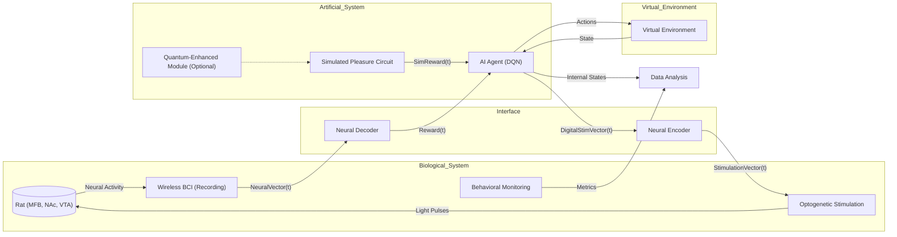

**Use Case:** This diagram provides a broad perspective of the BARLI-QM experiment, showing the interplay between the rat, AI agent, interface, and virtual environment, making it easier to grasp the experiment's structure.

**2. Biological System: Rat Brain and Data Collection**

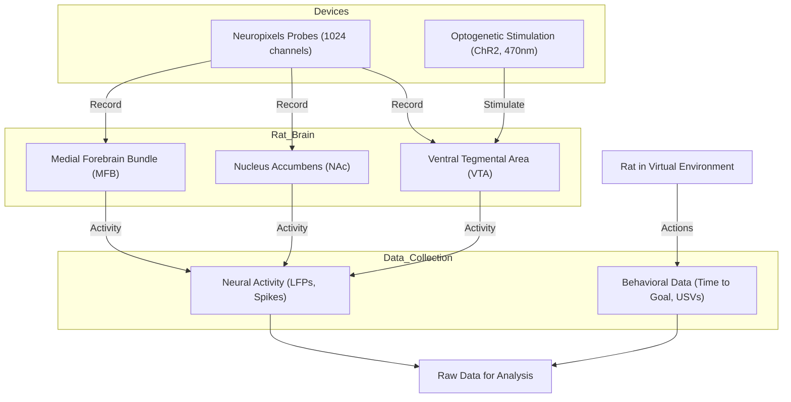

**Use Case:** This diagram explains the biological setup, focusing on how neural activity and behavior are captured from the rat, providing insight into the data collection process.

**3. Artificial System: AI Agent Architecture**

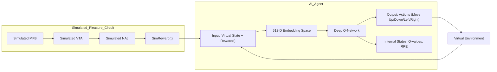

**Use Case:** This diagram details the AI agent's internal workings and its connection to the simulated pleasure circuit, clarifying how it processes inputs and generates actions.

**4. Bi-Directional Interface: Neural Decoding and Encoding**

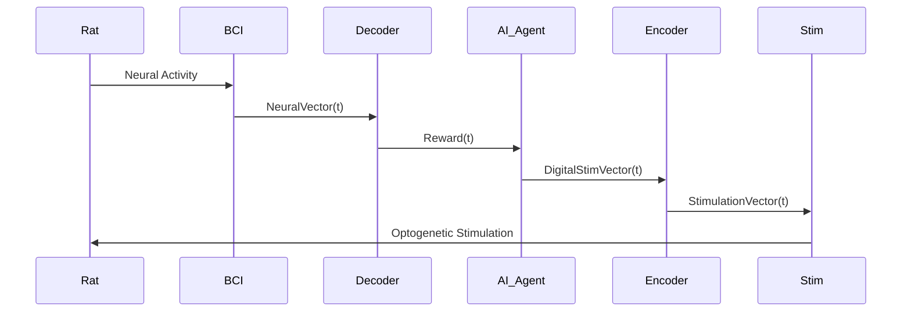

**Use Case:** This sequence diagram illustrates the bi-directional flow of information between the rat and AI, highlighting the decoding and encoding steps critical to the interface.

**5. Experimental Protocol: Phases and Tasks**

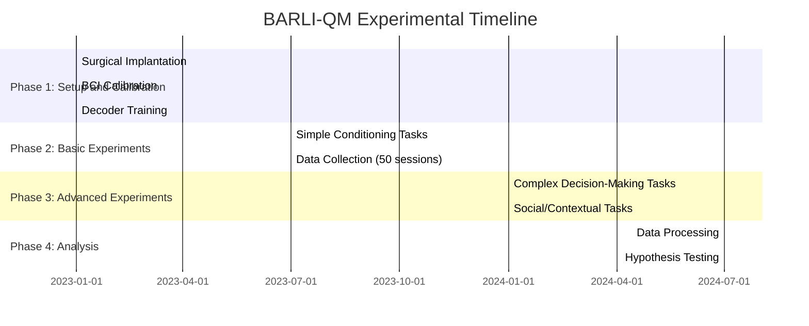

**Use Case:** This Gantt chart maps out the experiment's timeline, detailing phases and tasks to provide a clear schedule of activities.

**6. Data Analysis Pipeline**

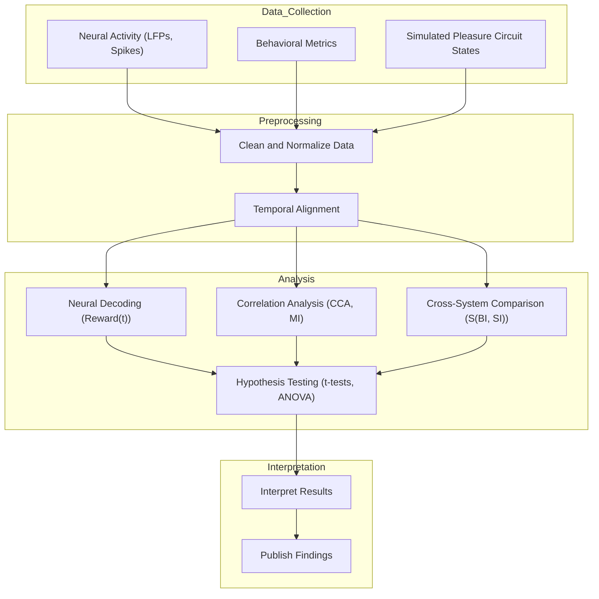

**Use Case:** This flowchart traces the journey of data from collection to analysis and interpretation, offering a structured view of the data pipeline.

**7. Hypothesis H1: Biological System Metrics**

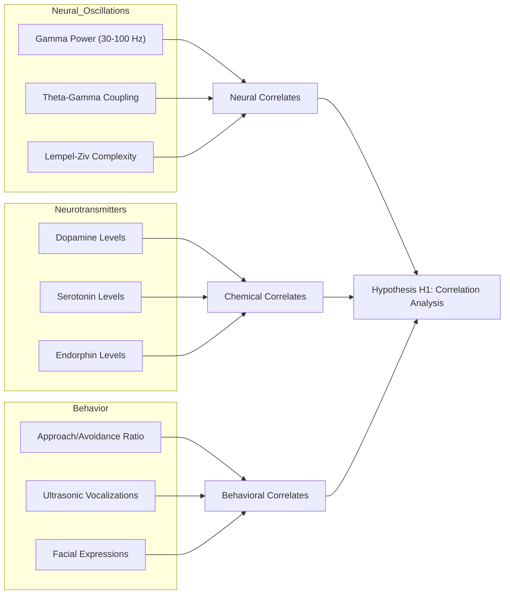

**Use Case:** This diagram shows how various metrics in the biological system are collected and analyzed to test Hypothesis H1, focusing on correlations with subjective experience.

**8. Hypothesis H2: Simulated System Comparison**

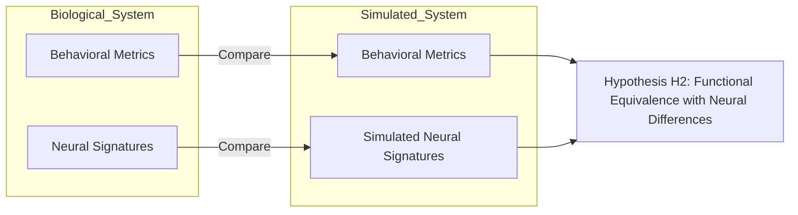

**Use Case:** This diagram compares the biological and simulated systems for Hypothesis H2, emphasizing similarities in behavior and differences in neural activity.

**9. Quantum-Enhanced Simulation (Optional)**

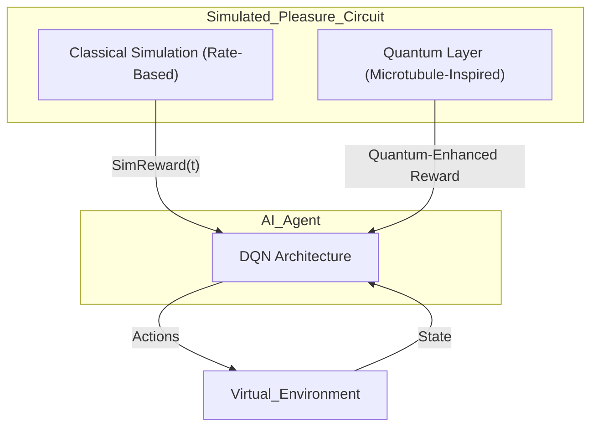

**Use Case:** This diagram explains how an optional quantum layer enhances the simulated pleasure circuit, showing its integration with the AI agent.

**10. Cross-System Similarity Metrics**

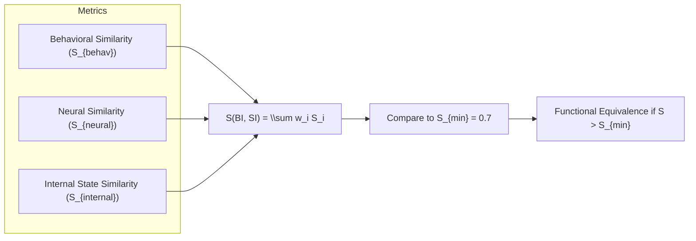

**Use Case:** This diagram outlines the process of calculating similarity metrics between the biological and artificial systems, assessing their functional equivalence.

**11. Ethical Oversight and Welfare Monitoring**

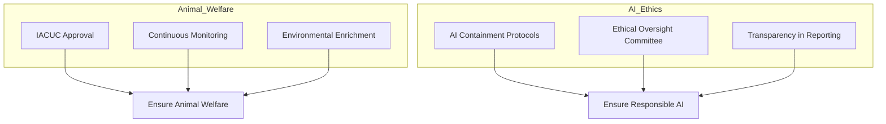

**Use Case:** This diagram details the ethical safeguards for animal welfare and AI usage, ensuring the experiment adheres to high ethical standards.

### Conclusion

These 11 Mermaid diagrams provide a thorough visual representation of the BARLI-QM experiment, covering its structure, processes, data analysis, hypotheses, and ethical considerations. Each diagram is tailored to a specific aspect, using the most appropriate Mermaid type to enhance understanding. Together, they offer a complete and detailed overview of the experiment's design and execution.
 