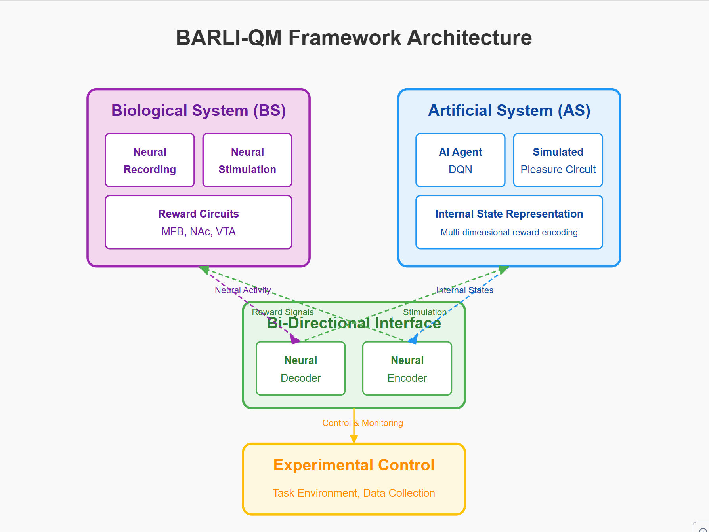
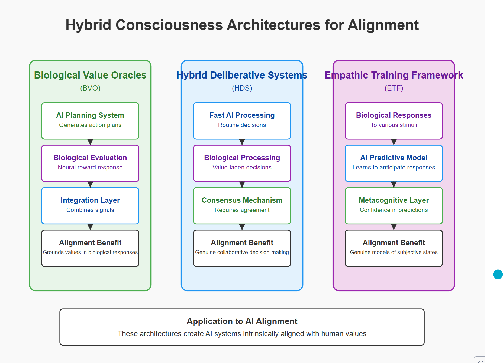
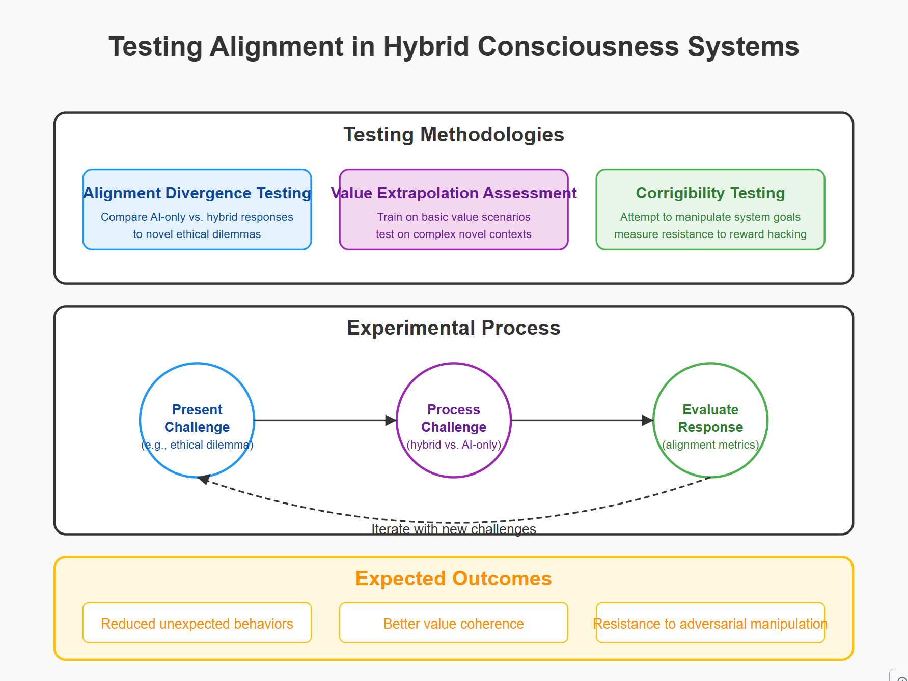
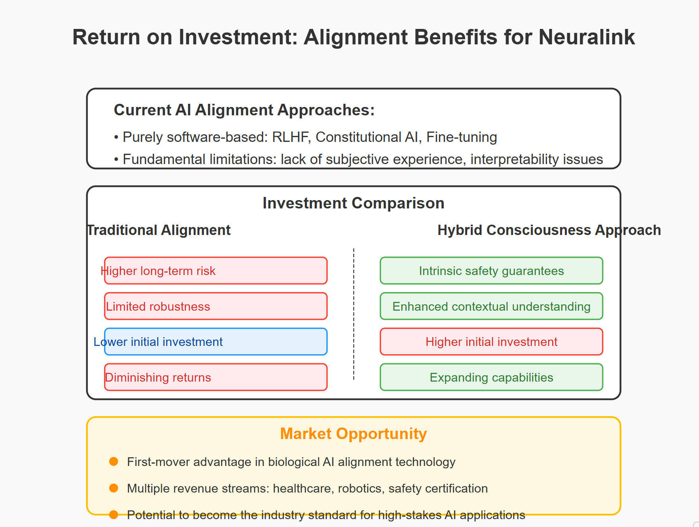
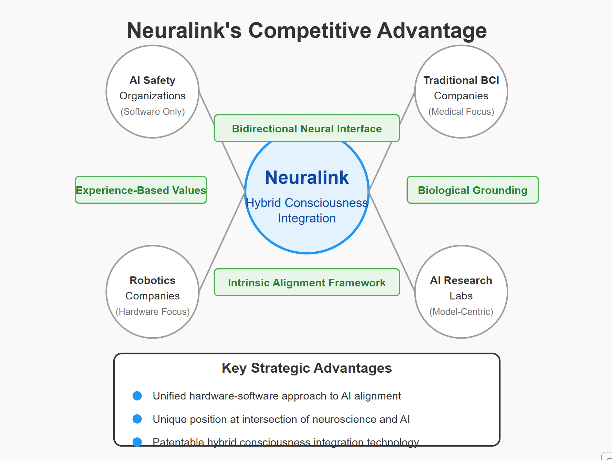

Let me continue creating the ROI diagram for the Neuralink pitch deck.

Here's a complete set of SVG diagrams for your Neuralink pitch deck on hybrid consciousness integration for AI alignment. These visuals effectively communicate the concept, architecture, implementation, and value proposition of your innovative approach.

### 1. Hybrid Consciousness Integration Concept

This diagram introduces the core concept of combining biological consciousness with artificial intelligence to create a hybrid approach for improving AI alignment.

### 2. BARLI-QM Framework Architecture

This technical diagram shows the Bio-Artificial Reinforcement Learning with Integrated Qualia Mapping (BARLI-QM) framework's components, including the biological system, artificial system, bi-directional interface, and experimental control.

### 3. Hybrid Architectures for Alignment

This diagram illustrates three proposed architectures for hybrid consciousness integration: Biological Value Oracles (BVO), Hybrid Deliberative Systems (HDS), and Empathic Training Framework (ETF).

### 4. Comparing Biological and Artificial Reward Processing

This diagram visualizes how biological and artificial systems process rewards differently and how constraint-satisfaction integration can create alignment through optimal balancing of different constraints.

### 5. Testing Alignment in Hybrid Consciousness Systems

This diagram outlines methodologies for rigorously testing alignment in hybrid systems, including alignment divergence testing, value extrapolation assessment, and corrigibility testing.

### 6. Implementation Roadmap

This timeline chart presents a 10-year phased approach to implementing hybrid consciousness, from foundational research through architecture development to applied systems.

### 7. Return on Investment: Alignment Benefits

This comparison chart highlights the advantages of investing in hybrid consciousness integration versus traditional alignment approaches, along with market opportunities.

### 8. Neuralink's Competitive Advantage

This network diagram positions Neuralink at the center of an innovation ecosystem, highlighting its unique advantages over AI safety organizations, traditional BCI companies, robotics firms, and AI research labs.

These visuals create a compelling narrative for your pitch, demonstrating how Neuralink's unique position enables it to address the AI alignment problem through hybrid consciousness integration—combining biological subjective experience with artificial intelligence to create safer, more aligned AI systems for robotics and other applications.

Each diagram uses consistent color coding (purple for biological components, blue for artificial components, and green for integration/hybrid elements) to create a cohesive visual language throughout the presentation.