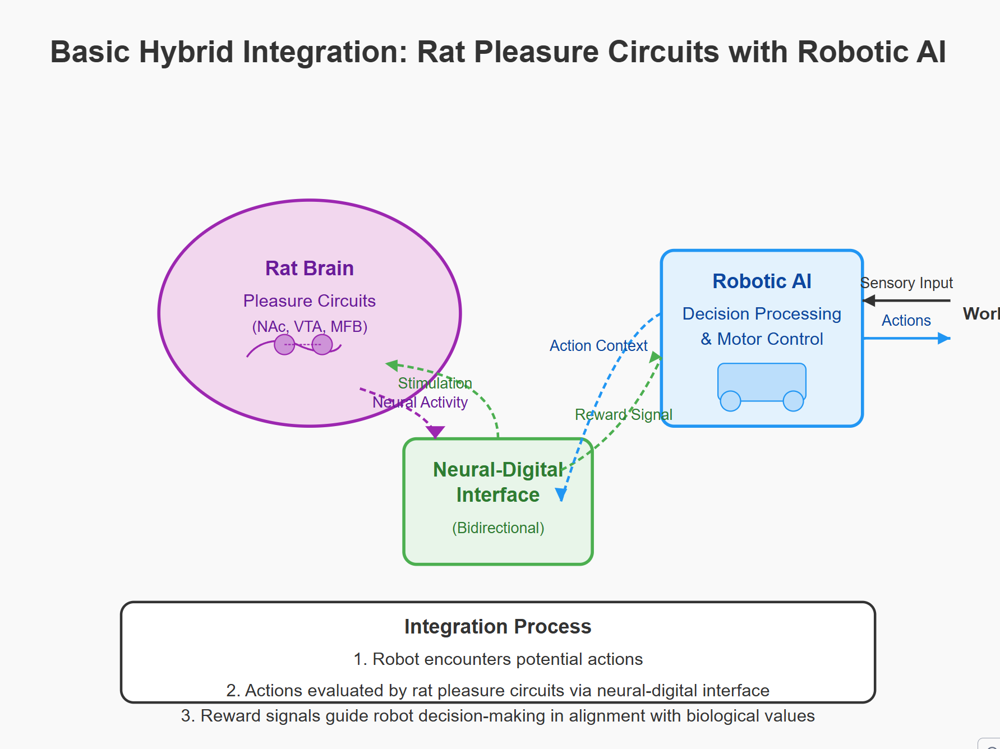
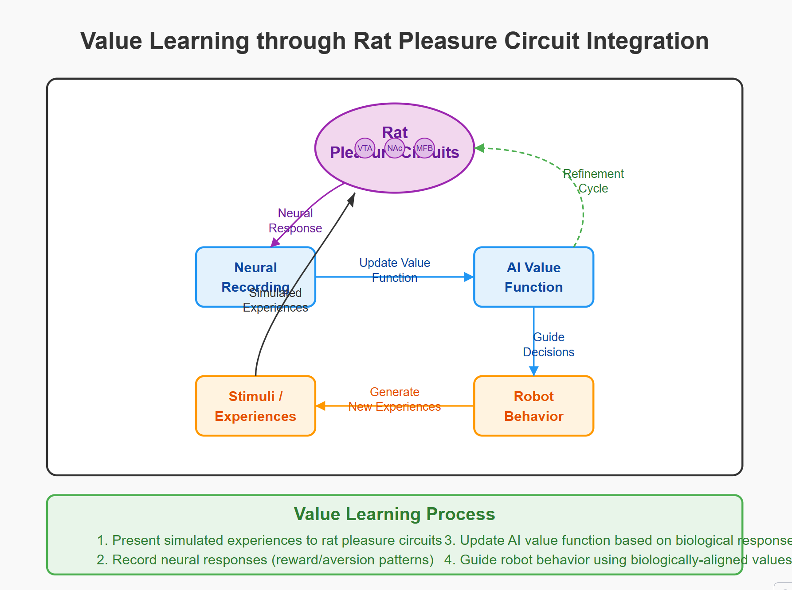
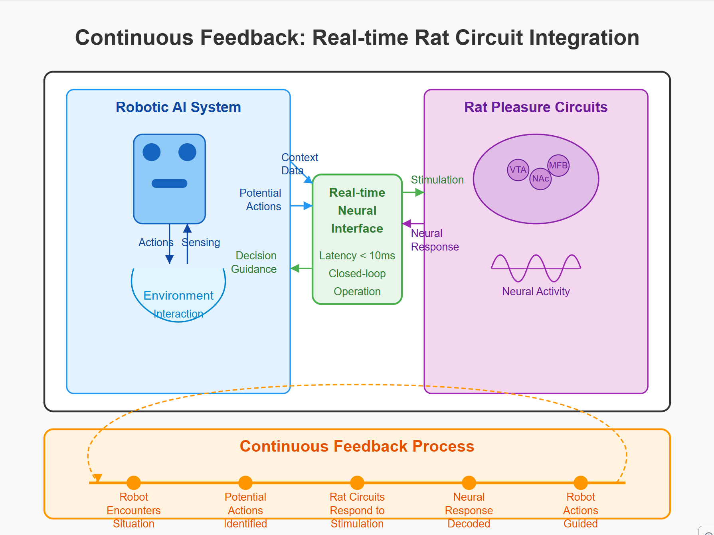
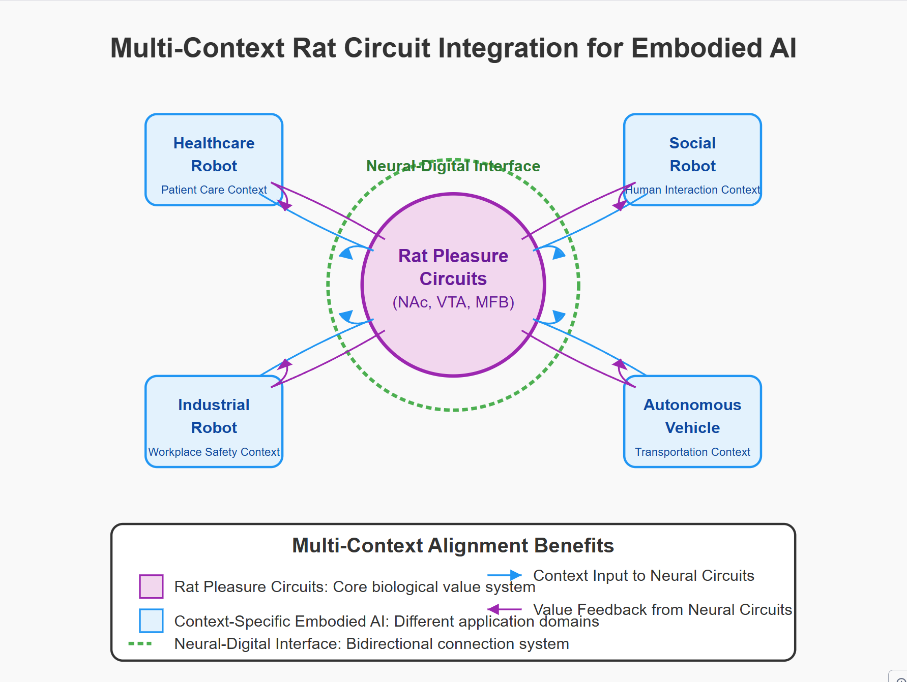

Let me continue creating the multi-context integration diagram for the rat pleasure circuit integration with embodied AI.

I've created a series of SVG diagrams illustrating how rat pleasure circuits can be integrated with embodied AI systems to create more aligned robotic systems. These visualizations demonstrate different approaches to hybrid brain-integrated models of alignment, focused specifically on rat neural reward pathways.

## 1. Basic Hybrid Integration: Rat Pleasure Circuits with Robotic AI

This diagram shows the fundamental architecture for integrating rat pleasure circuits with a robotic AI system:

The diagram illustrates how rat pleasure circuits (NAc, VTA, MFB) connect to a robotic AI system through a bidirectional neural-digital interface. This creates a closed loop where robot actions can be evaluated by biological reward systems, providing a natural foundation for alignment.

## 2. Ethical Decision-Making with Rat Pleasure Circuit Integration

This diagram demonstrates how rat pleasure circuits can help guide ethical decision-making in embodied AI:

When the robot encounters an ethical dilemma, potential actions are simulated and presented to the rat pleasure circuits, which generate neural responses indicating reward or aversion. These biological responses help guide the robot toward the most biologically-aligned decision.

## 3. Value Learning through Rat Pleasure Circuit Integration

This diagram shows how rat pleasure circuits can help an AI system learn values through iterative feedback:

The system presents simulated experiences to the rat pleasure circuits, records neural responses, and uses these responses to update the AI's value function. This creates a learning cycle where robot behavior becomes increasingly aligned with biologically-grounded values.

## 4. Continuous Feedback: Real-time Rat Circuit Integration

This diagram illustrates a real-time integration model where rat pleasure circuits provide continuous feedback to an embodied AI system:

With low-latency (<10ms) bidirectional communication, the rat pleasure circuits can evaluate robot actions in real-time, providing immediate feedback that guides robot behavior according to biological values.

## 5. Multi-Context Rat Circuit Integration for Embodied AI

This diagram shows how a single rat pleasure circuit integration can provide value alignment across multiple robot contexts:

The central rat pleasure circuits connect to various embodied AI applications (healthcare, social, industrial, autonomous vehicles), providing a consistent value framework across different contexts while still allowing context-specific adaptations.

These visualizations demonstrate how hybrid consciousness integration through rat pleasure circuits offers a promising approach to AI alignment for embodied systems. By grounding artificial value systems in biological reward circuits, we create robots that inherently share aspects of biological values rather than merely simulating them.