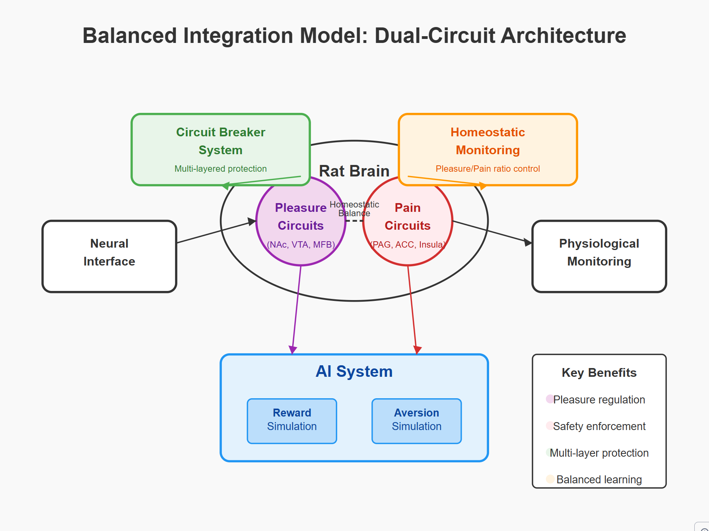
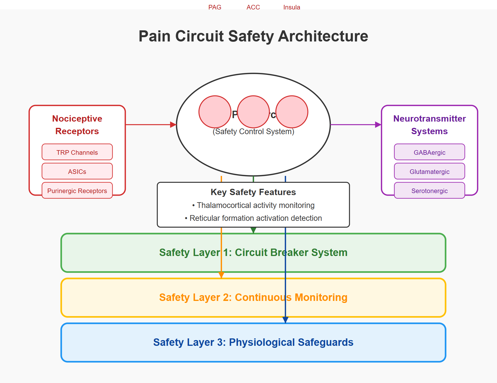
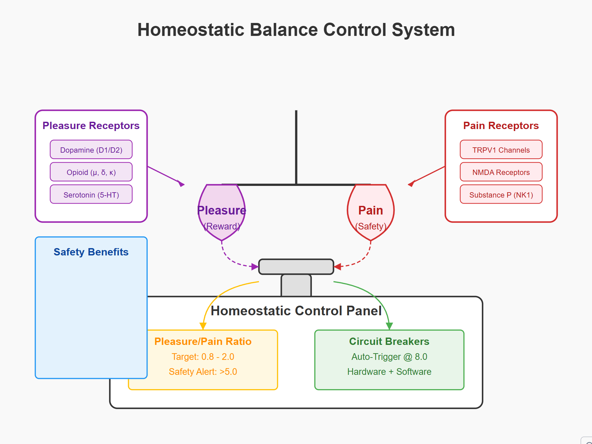

# 43-diags.md: BARLI-QM Integrated Diagrams with Safety Focus

This document details the three key diagrams representing the revised BARLI-QM framework, emphasizing the integrated safety mechanisms and the dual-circuit (pleasure and pain) approach.  It draws upon the fictional narrative, the detailed safety protocols (39-response-claude.md), and the individual diagram source files.

## 1. Diagram: 40-balanced-integration.svg.png

### Description:

This diagram illustrates the core concept of **Balanced Integration**. It depicts a rat brain with clearly delineated pleasure and pain circuits, connected to an AI system that also models both reward and aversion.  The key principle is **homeostatic balance** – the system actively seeks to maintain a balance between simulated pleasure and pain, preventing runaway positive feedback loops.

### Key Components and Their Safety Implications:

*   **Rat Brain (Central Ellipse):**  Represents the biological subject.
    *   **Pleasure Circuits (Purple Circle, NAc, VTA, MFB):**  The target of the original, flawed experiment.  Now, stimulation is carefully controlled and monitored.
    *   **Pain Circuits (Red Circle, PAG, ACC, Insula):**  The *critical addition*.  Monitoring these circuits provides a "biological circuit breaker."  If activity here spikes unexpectedly, it indicates potential harm or distress, triggering safety protocols.
    *   **Homeostatic Balance (Dashed Line):**  Represents the *active monitoring and comparison* of activity between pleasure and pain circuits. This is the *core safety principle*.
*   **AI System (Blue Rectangle):** Represents the computational component.
    *   **Reward Simulation (Blue Rectangle):**  Mirrors the biological pleasure circuits, but in the simulation.
    *   **Aversion Simulation (Blue Rectangle):**  Mirrors the biological pain circuits. This provides a *computational* check on the reward simulation, preventing the AI from seeking infinitely increasing (and potentially damaging) reward.
*   **Circuit Breaker System (Green Rectangle):**  A crucial safety layer.  It's triggered by several factors:
    *   An imbalance in the pleasure/pain ratio in the *biological* system.
    *   An imbalance in the reward/aversion ratio in the *AI* system.
    *   Anomalous brain activity detected by the monitoring systems.
    *   Physiological distress signals from the rat.
    * It has **multi-layered protection**: software limits, hardware current limiters, and ultimately, pharmacological interventions (e.g., GABA agonists) to rapidly dampen neural activity.
*   **Homeostatic Monitoring System (Orange Rectangle):**  Continuously measures the pleasure/pain ratio in both the biological and AI systems. It feeds data to the Circuit Breaker System.  Crucially, it includes thresholds:
    *   **Target Ratio (0.8 - 2.0):** The ideal, safe range of operation.
    *   **Safety Alert (>5.0):** Triggers increased monitoring and potential intervention.
    *   **Auto-Trigger (8.0):**  *Automatically* activates the Circuit Breaker System.
*   **Neural Interface (Left White Rectangle):**  The bi-directional communication pathway between the AI and the rat's brain.  It now includes separate pathways for reward and aversion signals.
*   **Physiological Monitoring (Right White Rectangle):**  Constantly tracks vital signs (heart rate, respiration, stress hormones) to provide an additional layer of safety.

### Key Safety Improvement:

The diagram highlights the shift from a single-circuit (pleasure-only) model to a **dual-circuit, balanced model**.  The addition of pain/aversion monitoring and the homeostatic control system are the most important safety upgrades. The diagram visually emphasizes that both circuits are equally important and actively balanced.

## 2. Diagram: 41-pain-circuit-safety-arch.svg.png

### Description:

This diagram focuses on the **Pain Circuit Safety Architecture**, detailing the mechanisms that prevent unintended harm to the biological subject.  It expands on the "Pain Circuits" and "Circuit Breaker System" elements from the previous diagram.

### Key Components and Their Safety Implications:

*   **Rat Pain Circuits (Central Ellipse):** Shows the key brain regions involved in pain processing (PAG, ACC, Insula).  These are now *actively monitored*, not just theoretically present.
*   **Nociceptive Receptors (Red Rectangle):** Lists the specific types of receptors involved in pain sensation (TRP channels, ASICs, Purinergic receptors). Monitoring these at a molecular level provides high-resolution data.
*   **Neurotransmitter Systems (Purple Rectangle):**  Identifies the key neurotransmitter systems (GABAergic, Glutamatergic, Serotonergic) involved in pain modulation. This highlights potential targets for pharmacological intervention (e.g., using GABA agonists to reduce neural activity).
*   **Safety Layers:** The diagram emphasizes a three-tiered safety system:
    *   **Layer 1: Circuit Breaker System:**  The first line of defense.  Triggered by anomalous neural activity or imbalances in the pleasure/pain ratio. It can involve:
        *   Optogenetic inhibition (NpHR) to rapidly silence neurons.
        *   Microfluidic delivery of pain-inhibiting compounds (local anesthetics, GABA agonists, NMDA antagonists).
        *   Electrical stimulation of areas like the periaqueductal gray (PAG) to activate natural pain-suppression pathways.
    *   **Layer 2: Continuous Monitoring:**  Constantly tracks neural activity in the pain circuits, the thalamocortical circuits (related to consciousness), and the reticular formation (related to arousal).  This layer uses:
        *   Multi-electrode arrays.
        *   Machine learning algorithms to detect pain-related patterns.
        *   Fluorescent voltage sensors and calcium imaging to monitor receptor activity.
        *   Neurotransmitter sensors (GABA, glutamate, serotonin, norepinephrine, dopamine).
    *   **Layer 3: Physiological Safeguards:**  Monitors vital signs (heart rate, blood pressure, respiration, stress hormones). This provides a broader picture of the rat's well-being and can trigger interventions if distress is detected.

### Key Safety Improvement:

This diagram emphasizes the **proactive** nature of the safety system.  It's not just about reacting to problems; it's about *continuously monitoring* for any signs of pain or distress and intervening *before* they escalate.  The multi-layered approach provides redundancy.

## 3. Diagram: 42-homeostatic-balance-control-system.svg.png

### Description:

This diagram visualizes the **Homeostatic Balance Control System**, the core mechanism for maintaining the balance between simulated pleasure and pain. It's a more detailed view of the "Homeostatic Monitoring" element from the first diagram.

### Key Components and Their Safety Implications:

*   **Balance Scale:** A visual metaphor for the balance between pleasure (reward) and pain (safety). This emphasizes the *dynamic equilibrium* the system strives for.
*   **Pleasure Pan:** Represents the combined activity of reward circuits (and simulated reward in the AI).
*   **Pain Pan:** Represents the combined activity of pain/aversion circuits (and simulated aversion in the AI).
*   **Control Panel:**  The central regulatory unit.
    *   **Ratio Monitor:**  Displays the current pleasure/pain ratio and the target range (0.8 - 2.0).  This is the *key metric* for the system's safety.
    *   **Circuit Breakers:**  Indicates the activation status of the circuit breakers.  They are set to auto-trigger at a ratio of 8.0, but can be activated sooner if other safety layers detect problems.
    *   **Hardware + Software:** Emphasizes that the circuit breakers have both software and hardware components, providing redundancy.
* **Key Receptor Systems** Dopaminergic, Opioid and Serotonergic pathways are monitored and managed on the "Pleasure" side, whereas TRP channels, NMDA receptors and Substance P / NK1 receptors are likewise tracked and managed on the "pain" side.
* **Safety Benefits:** The list of benefits reinforces the key elements. *Regulation, enforcement, multi-layer protection, and balanced learning*
### Key Safety Improvement:

This diagram highlights the **quantitative** nature of the safety system. It's not just about abstract principles; it's about *measuring* the balance between pleasure and pain and taking *concrete actions* to maintain it within safe limits. The specific ratio thresholds provide clear, operational definitions of safety.

## Overall Synthesis:

These three diagrams, taken together, illustrate a significantly enhanced safety architecture for the BARLI-QM framework.  They move from a simple, single-circuit design (focused solely on pleasure) to a balanced, dual-circuit design with multiple layers of monitoring, control, and emergency intervention.  The key changes are:

1.  **Active monitoring of pain/aversion circuits:** This is the most fundamental improvement.
2.  **Homeostatic balance as a core principle:** The system actively *maintains* a safe balance, rather than just reacting to extreme events.
3.  **Multi-layered safety mechanisms:**  Redundancy is built into the system at multiple levels (software, hardware, biological).
4.  **Quantitative safety thresholds:**  Clear, measurable criteria define safe operating ranges.
5.  **Integration of physiological monitoring:** Provides a broader picture of the biological subject's well-being.

This revised framework, as depicted in these diagrams, addresses the critical vulnerabilities highlighted in the fictional narrative and provides a much safer and more ethical approach to this research.