# Detailed Diagrams for the BARLI Experiment

## Diagram Descriptions

Following is a comprehensive set of diagrams to visualize the Bio-Artificial Reward Learning with Integrated Qualia Mapping (BARLI) framework. Each diagram captures different aspects of this complex experiment:

1. **BARLI Framework Overview**: Shows the main components of the experiment, including the biological system (rat), artificial system (AI), bi-directional interface, and experimental environment, along with their interconnections.

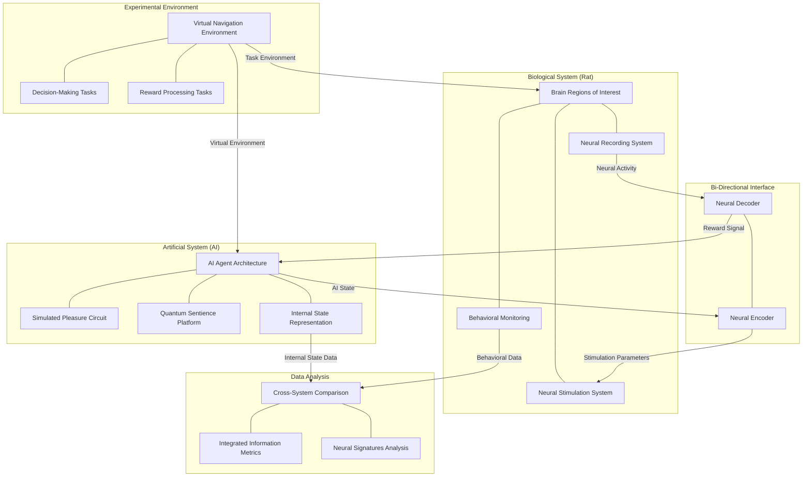

2. **Biological System: Rat Neural Circuits**: Illustrates the brain regions of interest (MFB, NAc, VTA, etc.), neural recording techniques, stimulation methods, neurochemical monitoring, and behavioral assessment approaches.

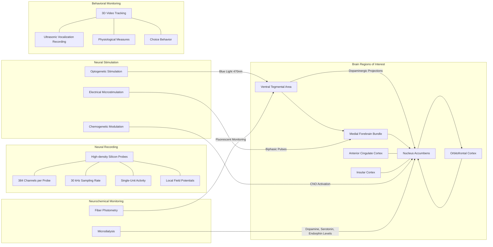

3. **Artificial System: AI Architecture**: Details the AI agent's structure, including value networks, policy networks, world models, simulated pleasure circuits, and internal state representations.

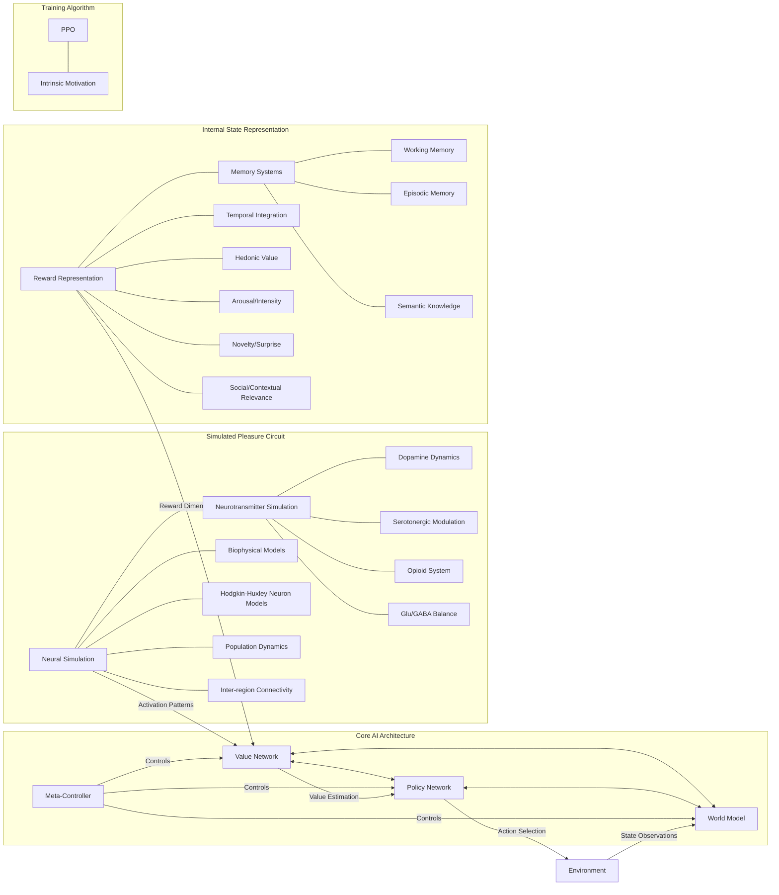

4. **Bi-Directional Interface: Neural-AI Communication**: Shows the sequential flow of information between the rat brain and AI system through neural decoders and encoders, highlighting the closed-loop nature of the experiment.

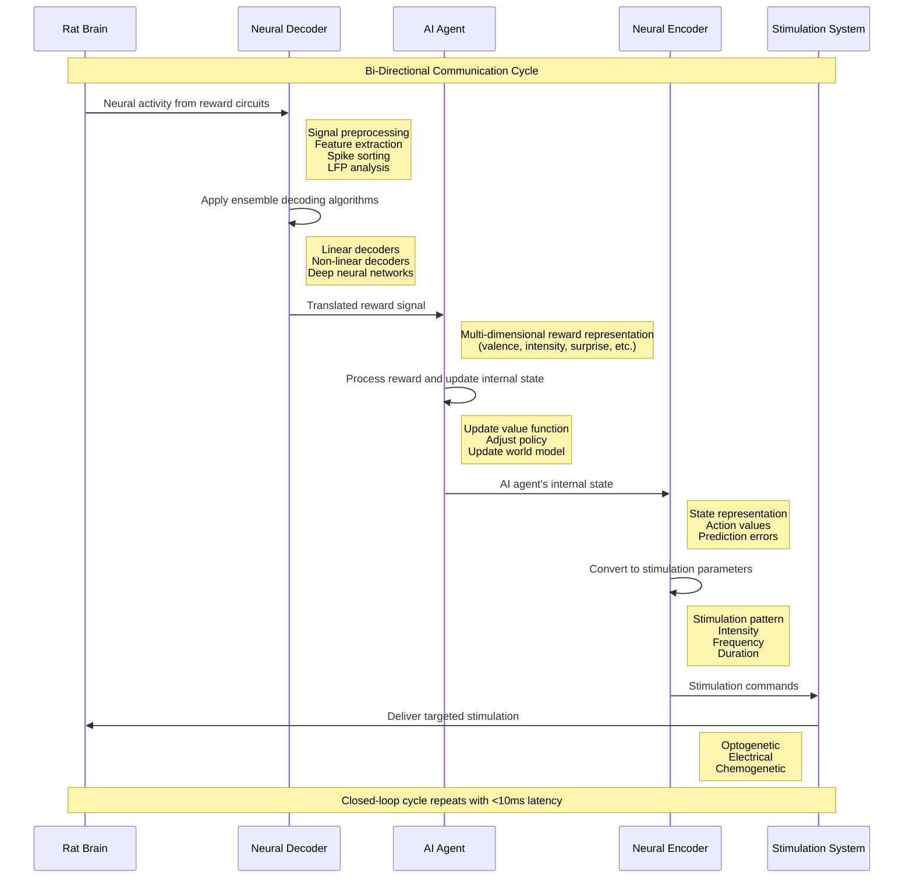

5. **Experimental Protocol: Tasks and Phases**: Maps out the experimental phases from calibration through simple conditioning, decision-making tasks, and social/contextual tasks, showing how experimental conditions are applied.

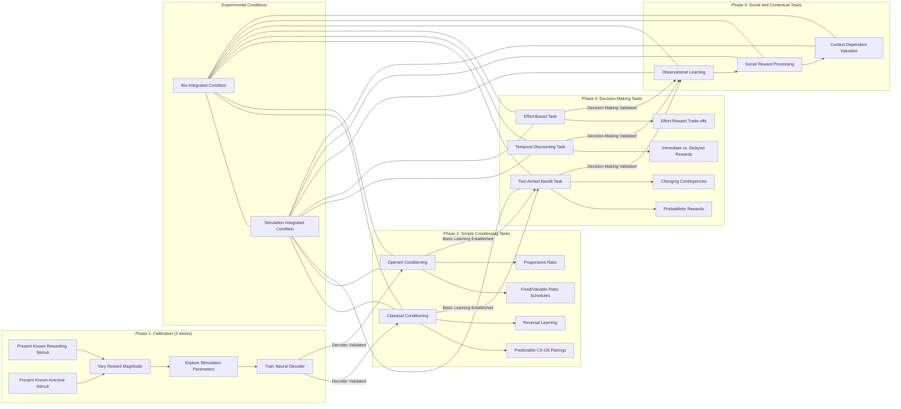

6. **Data Collection and Analysis Pipeline**: Visualizes how data flows from collection through processing and analysis, including the different types of data and analytical approaches.

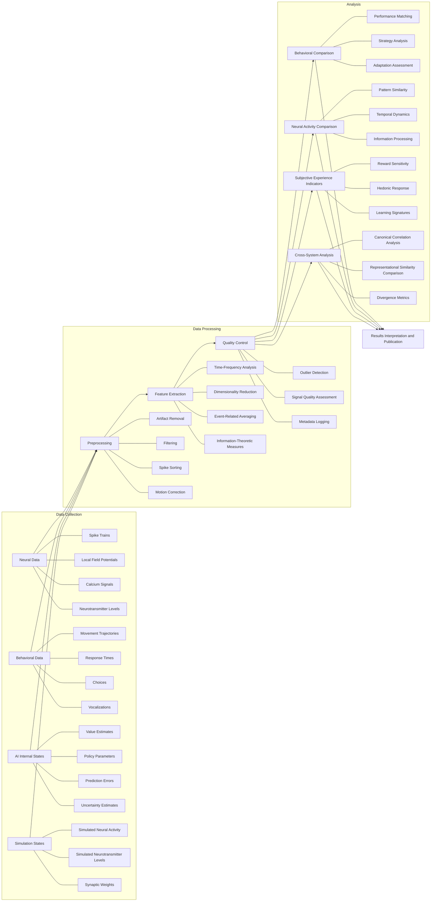

7. **Hypothesis Testing Framework**: Outlines the four main hypotheses being tested, the metrics used to evaluate them, and the analytical methods applied.

```mermaid
graph LR
    subgraph "H1: Bio-AI Correlation"
        H1[AI agent coupled to rat pleasure circuits will develop reward learning patterns correlating with neural signatures of subjective experience]
        
        H1M1[Gamma power and coherence: r > 0.7, p < 0.01]
        H1M2[Approximated Φ: Significant increase during reward]
        H1M3[Dopamine/serotonin ratio: R > 1.5 for positive valence]
        H1M4[Approach/avoidance ratio: > 2:1]
        
        H1 --- H1M1
        H1 --- H1M2
        H1 --- H1M3
        H1 --- H1M4
        
        H1A1[Pearson correlation between neural signatures and AI signals]
        H1A2[Multiple regression predicting behavioral responses]
        H1A3[Time-lagged cross-correlation for temporal dynamics]
        
        H1 --- H1A1
        H1 --- H1A2
        H1 --- H1A3
    end
    
    subgraph "H2: Functional Equivalence"
        H2[AI with simulated pleasure circuit will match biological behavior but differ in neural signatures]
        
        H2M1["Behavioral equivalence: |d| < 0.2 (small effect size)"]
        H2M2["Neural difference: |d| > 0.8 (large effect size)"]
        H2M3[Modulation index: Higher in biological system, p < 0.01]
        
        H2 --- H2M1
        H2 --- H2M2
        H2 --- H2M3
        
        H2A1[Paired t-tests comparing behavioral metrics]
        H2A2[MANOVA on neural signature metrics]
        H2A3[Representational Similarity Analysis]
        
        H2 --- H2A1
        H2 --- H2A2
        H2 --- H2A3
    end
    
    subgraph "H3: Complexity-Divergence"
        H3[Divergence between systems will increase with task complexity]
        
        H3M1[Regression analysis: R² > 0.6]
        H3M2["Divergence metric: D(BI, SI)task"]
        
        H3 --- H3M1
        H3 --- H3M2
        
        H3A1[Regression analysis of divergence vs complexity]
        H3A2[Repeated measures ANOVA]
        H3A3[Curve fitting to characterize relationship]
        
        H3 --- H3A1
        H3 --- H3A2
        H3 --- H3A3
    end
    
    subgraph "H4: Information Integration"
        H4[Φ will correlate with subjective experience indicators with substrate-specific differences]
        
        H4M1[Correlation strength: r > 0.7]
        H4M2["Difference in correlations: |r₁-r₂| > 0.2"]
        
        H4 --- H4M1
        H4 --- H4M2
        
        H4A1[Correlation analysis between Φ and behavioral indicators]
        H4A2[Comparison of correlation patterns between systems]
        H4A3[Path analysis modeling direct/indirect relationships]
        
        H4 --- H4A1
        H4 --- H4A2
        H4 --- H4A3
    end
    
    H1 --> Overall[Overall Conclusion about Consciousness Correlates]
    H2 --> Overall
    H3 --> Overall
    H4 --> Overall
```

8. **Project Timeline and Milestones**: Provides a Gantt chart showing the 36-month project timeline across three major phases, with key milestones and publication targets.

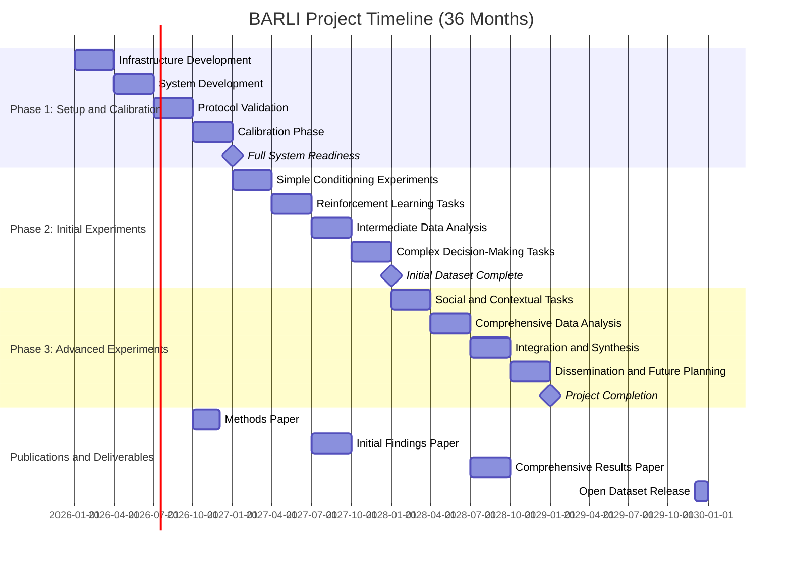

9. **Operationalizing Subjective Experience**: Details the metrics and measurements used to quantify aspects of subjective experience, from neural oscillations to behavioral indicators.

```mermaid
graph LR
    subgraph "Neural Oscillatory Signatures"
        NOS1["Gamma Band Activity (30-100 Hz)"]
        NOS2[Cross-Frequency Coupling]
        NOS3[Neural Complexity Measures]
        
        NOS1_1["Gamma power: ∫₃₀¹⁰⁰ P(f) df"]
        NOS1_2[Gamma coherence between recording sites]
        NOS1_3[Gamma bursting rate and duration]
        
        NOS1 --- NOS1_1
        NOS1 --- NOS1_2
        NOS1 --- NOS1_3
        
        NOS2_1[Modulation Index: MI]
        NOS2_2[Preferred phase of theta]
        NOS2_3[Coupling directionality]
        
        NOS2 --- NOS2_1
        NOS2 --- NOS2_2
        NOS2 --- NOS2_3
        
        NOS3_1["Lempel-Ziv complexity (LZC)"]
        NOS3_2[Sample entropy]
        NOS3_3[Coalition entropy]
        
        NOS3 --- NOS3_1
        NOS3 --- NOS3_2
        NOS3 --- NOS3_3
    end
    
    subgraph "Neurotransmitter Dynamics"
        ND1[Reward Chemical Balance]
        ND2[Temporal Release Patterns]
        ND3[Hedonic Impact Indicators]
        
        ND1_1["DA/5-HT ratio: R(D/S)"]
        ND1_2["Absolute concentrations: [DA], [5-HT]"]
        ND1_3[Release probability]
        
        ND1 --- ND1_1
        ND1 --- ND1_2
        ND1 --- ND1_3
        
        ND2_1["Phasic/tonic ratio: R(P/T)"]
        ND2_2[Response latency]
        ND2_3[Decay kinetics]
        
        ND2 --- ND2_1
        ND2 --- ND2_2
        ND2 --- ND2_3
        
        ND3_1["Endorphin concentration: [END]"]
        ND3_2["Endocannabinoid levels: [2-AG], [AEA]"]
        ND3_3[Opioid receptor activation]
        
        ND3 --- ND3_1
        ND3 --- ND3_2
        ND3 --- ND3_3
    end
    
    subgraph "Behavioral Indicators"
        BI1["Ultrasonic Vocalizations (USVs)"]
        BI2[Facial and Bodily Expressions]
        BI3[Motivational Indicators]
        
        BI1_1["USV ratio: USV(ratio) = N(50kHz)/N(22kHz)"]
        BI1_2[Call rate: calls per minute]
        BI1_3[Acoustic features]
        
        BI1 --- BI1_1
        BI1 --- BI1_2
        BI1 --- BI1_3
        
        BI2_1[Grimace Scale]
        BI2_2[Facial relaxation]
        BI2_3[Body posture]
        
        BI2 --- BI2_1
        BI2 --- BI2_2
        BI2 --- BI2_3
        
        BI3_1[Breakpoint in progressive ratio]
        BI3_2[Preference strength]
        BI3_3[Consumption pattern]
        
        BI3 --- BI3_1
        BI3 --- BI3_2
        BI3 --- BI3_3
    end
    
    subgraph "Integrated Information Metrics"
        IIM1["Phi (Φ) Approximation"]
        IIM2[Information Dynamics]
        IIM3[Metastability Measures]
        
        IIM1_1["Approximate Φ"]
        IIM1_2[Effective Information]
        IIM1_3[Causal Density]
        
        IIM1 --- IIM1_1
        IIM1 --- IIM1_2
        IIM1 --- IIM1_3
        
        IIM2_1[Transfer Entropy]
        IIM2_2[Active Information Storage]
        IIM2_3[Predictive Information]
        
        IIM2 --- IIM2_1
        IIM2 --- IIM2_2
        IIM2 --- IIM2_3
        
        IIM3_1[Synchrony variability]
        IIM3_2[Coalition entropy]
        IIM3_3[Criticality indicators]
        
        IIM3 --- IIM3_1
        IIM3 --- IIM3_2
        IIM3 --- IIM3_3
    end
    
    subgraph "AI System Subjective Correlates"
        AISC1[Representational Geometry]
        AISC2[Reward Prediction Dynamics]
        AISC3[Simulated Neurotransmitter Dynamics]
        
        AISC1_1["Representational Dissimilarity Matrix (RDM)"]
        AISC1_2[Dimensionality]
        AISC1_3[Clustering coefficient]
        
        AISC1 --- AISC1_1
        AISC1 --- AISC1_2
        AISC1 --- AISC1_3
        
        AISC2_1["Reward Prediction Error (RPE)"]
        AISC2_2[Uncertainty estimation]
        AISC2_3[Surprise signals]
        
        AISC2 --- AISC2_1
        AISC2 --- AISC2_2
        AISC2 --- AISC2_3
        
        AISC3_1[Simulated DA/5-HT ratio]
        AISC3_2[Phasic/tonic patterns]
        AISC3_3[Neuromodulatory effects]
        
        AISC3 --- AISC3_1
        AISC3 --- AISC3_2
        AISC3 --- AISC3_3
    end
    
    NOS1 --> ComparisonFramework
    NOS2 --> ComparisonFramework
    NOS3 --> ComparisonFramework
    ND1 --> ComparisonFramework
    ND2 --> ComparisonFramework
    ND3 --> ComparisonFramework
    BI1 --> ComparisonFramework
    BI2 --> ComparisonFramework
    BI3 --> ComparisonFramework
    IIM1 --> ComparisonFramework
    IIM2 --> ComparisonFramework
    IIM3 --> ComparisonFramework
    AISC1 --> ComparisonFramework
    AISC2 --> ComparisonFramework
    AISC3 --> ComparisonFramework
    
    ComparisonFramework[Cross-System Comparison Framework]
```

10. **Ethical Considerations and Regulatory Compliance**: Illustrates the comprehensive ethical framework, including animal welfare principles, regulatory compliance, AI ethics, and data management practices.

```mermaid
flowchart LR
    subgraph "Animal Welfare & 3Rs Principle"
        AW1[Replacement Strategies]
        AW2[Reduction Strategies]
        AW3[Refinement Approaches]
        
        AW1_1[Use of Existing Data]
        AW1_2[Alternative Models]
        AW1_3[Justification for Animal Use]
        
        AW1 --- AW1_1
        AW1 --- AW1_2
        AW1 --- AW1_3
        
        AW2_1[Statistical Optimization]
        AW2_2[Maximizing Data Collection]
        AW2_3[Tissue Sharing]
        
        AW2 --- AW2_1
        AW2 --- AW2_2
        AW2 --- AW2_3
        
        AW3_1[Surgical Procedures]
        AW3_2[Pain Management]
        AW3_3[Housing and Enrichment]
        AW3_4[Humane Endpoints]
        
        AW3 --- AW3_1
        AW3 --- AW3_2
        AW3 --- AW3_3
        AW3 --- AW3_4
    end
    
    subgraph "Regulatory Compliance"
        RC1["Institutional Animal Care and Use Committee (IACUC)"]
        RC2[Animal Welfare Regulations]
        RC3[Researcher Training and Qualification]
        
        RC1_1[Protocol Submission]
        RC1_2[Ongoing Oversight]
        RC1_3[Documentation Requirements]
        
        RC1 --- RC1_1
        RC1 --- RC1_2
        RC1 --- RC1_3
        
        RC2_1[Federal Compliance]
        RC2_2[State and Local Requirements]
        RC2_3[International Standards]
        
        RC2 --- RC2_1
        RC2 --- RC2_2
        RC2 --- RC2_3
        
        RC3_1[Required Training]
        RC3_2[Surgical Qualifications]
        RC3_3[Continuing Education]
        
        RC3 --- RC3_1
        RC3 --- RC3_2
        RC3 --- RC3_3
    end
    
    subgraph "Responsible AI Development"
        AI1[AI Safety Protocols]
        AI2[Avoiding AI Misuse]
        AI3[Artificial Sentience Considerations]
        
        AI1_1[System Containment]
        AI1_2[Monitoring Frameworks]
        AI1_3[Interpretability Measures]
        
        AI1 --- AI1_1
        AI1 --- AI1_2
        AI1 --- AI1_3
        
        AI2_1[Dual-Use Considerations]
        AI2_2[Data Security]
        AI2_3[Responsible Disclosure]
        
        AI2 --- AI2_1
        AI2 --- AI2_2
        AI2 --- AI2_3
        
        AI3_1[Welfare Monitoring]
        AI3_2[Systems Design]
        AI3_3[Contingency Planning]
        
        AI3 --- AI3_1
        AI3 --- AI3_2
        AI3 --- AI3_3
    end
    
    subgraph "Data Management and Privacy"
        DM1[Data Security]
        DM2[Confidentiality and Anonymization]
        DM3[Open Science and Data Sharing]
        
        DM1_1[Storage Infrastructure]
        DM1_2[Access Protocols]
        DM1_3[Data Transmission]
        
        DM1 --- DM1_1
        DM1 --- DM1_2
        DM1 --- DM1_3
        
        DM2_1[Identification Removal]
        DM2_2[Aggregation Techniques]
        DM2_3[Data Minimization]
        
        DM2 --- DM2_1
        DM2 --- DM2_2
        DM2 --- DM2_3
        
        DM3_1[Data Sharing Plan]
        DM3_2[Reproducibility Package]
        DM3_3[Licensing and Attribution]
        
        DM3 --- DM3_1
        DM3 --- DM3_2
        DM3 --- DM3_3
    end
    
    subgraph "Societal Implications"
        SI1[Philosophical and Societal Impact]
        SI2[Stakeholder Consultation]
        SI3[Responsible Communication]
        
        SI1_1[Knowledge Dissemination]
        SI1_2[Ethical Implications]
        SI1_3[Policy Engagement]
        
        SI1 --- SI1_1
        SI1 --- SI1_2
        SI1 --- SI1_3
        
        SI2_1[Scientific Community]
        SI2_2[Ethics Boards]
        SI2_3[Public Engagement]
        
        SI2 --- SI2_1
        SI2 --- SI2_2
        SI2 --- SI2_3
        
        SI3_1[Media Engagement]
        SI3_2[Managing Expectations]
        SI3_3[Scientific Integrity]
        
        SI3 --- SI3_1
        SI3 --- SI3_2
        SI3 --- SI3_3
    end
    
    AW1 --> EthicsCommittee
    AW2 --> EthicsCommittee
    AW3 --> EthicsCommittee
    RC1 --> EthicsCommittee
    RC2 --> EthicsCommittee
    RC3 --> EthicsCommittee
    AI1 --> EthicsCommittee
    AI2 --> EthicsCommittee
    AI3 --> EthicsCommittee
    DM1 --> EthicsCommittee
    DM2 --> EthicsCommittee
    DM3 --> EthicsCommittee
    SI1 --> EthicsCommittee
    SI2 --> EthicsCommittee
    SI3 --> EthicsCommittee
    
    EthicsCommittee[Ethics Committee Oversight and Review]
```

11. **Cross-System Comparison Methodology**: Shows how the biological and simulated systems are compared across different dimensions, including the calculation of similarity metrics and analysis of task complexity effects.

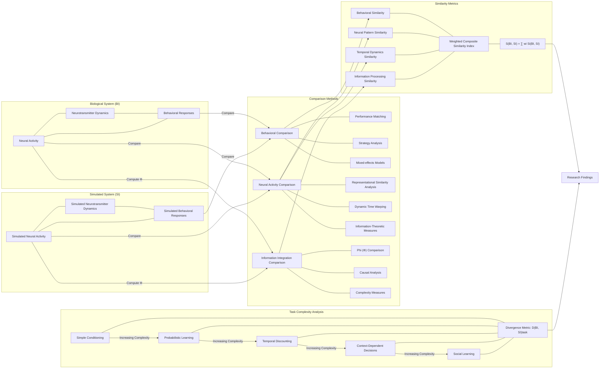

12. **Risk Management and Contingency Planning**: Outlines potential technical, biological, schedule, and budget risks, along with mitigation strategies, contingency plans, and monitoring processes.

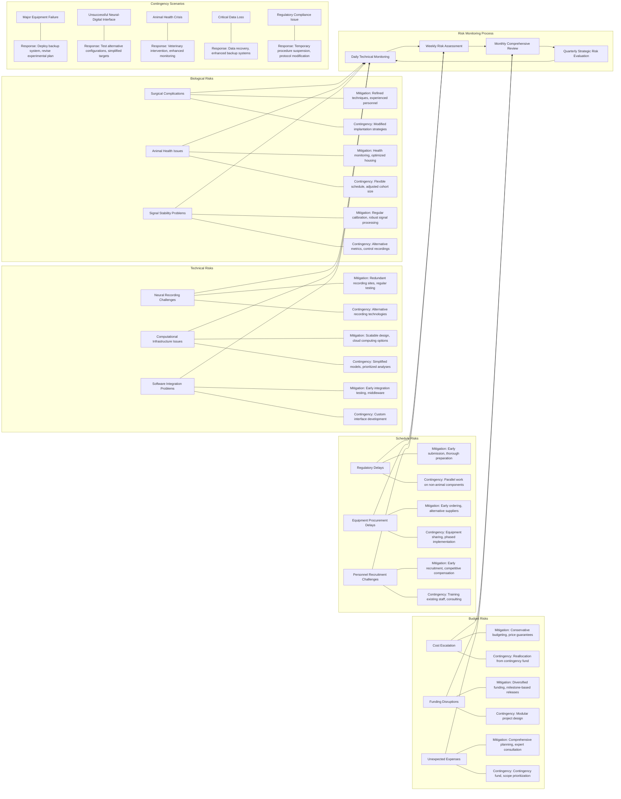

