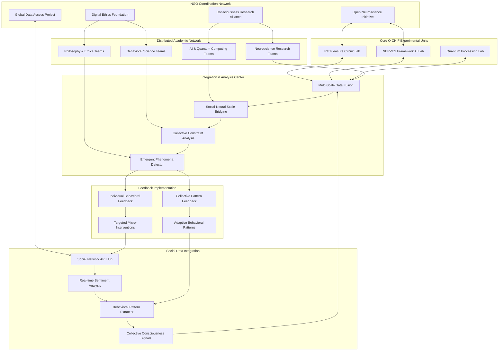
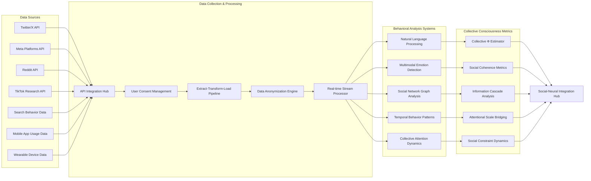
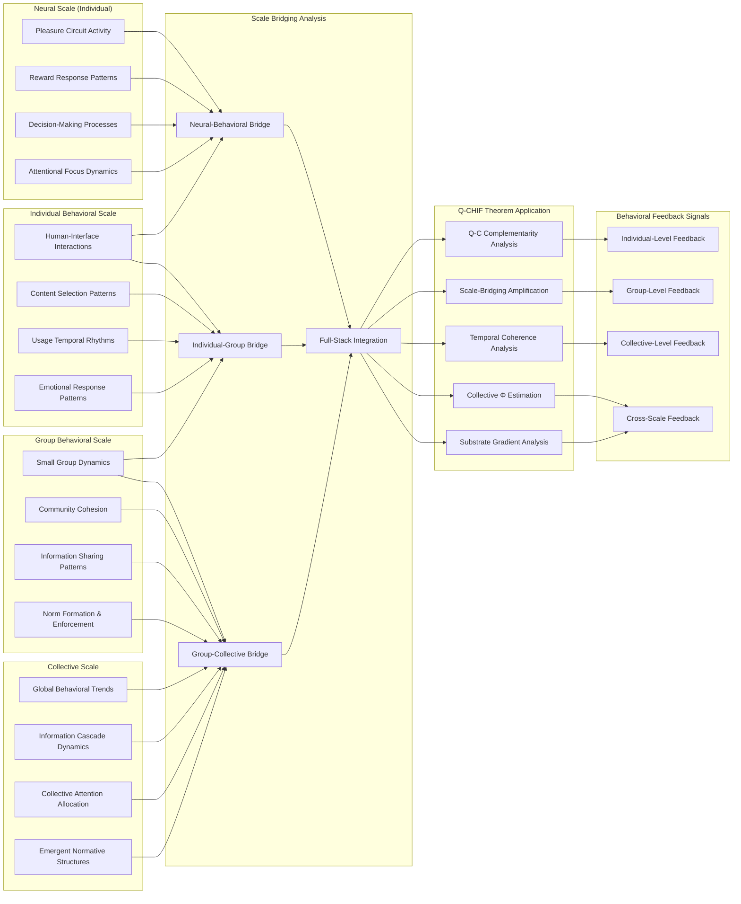
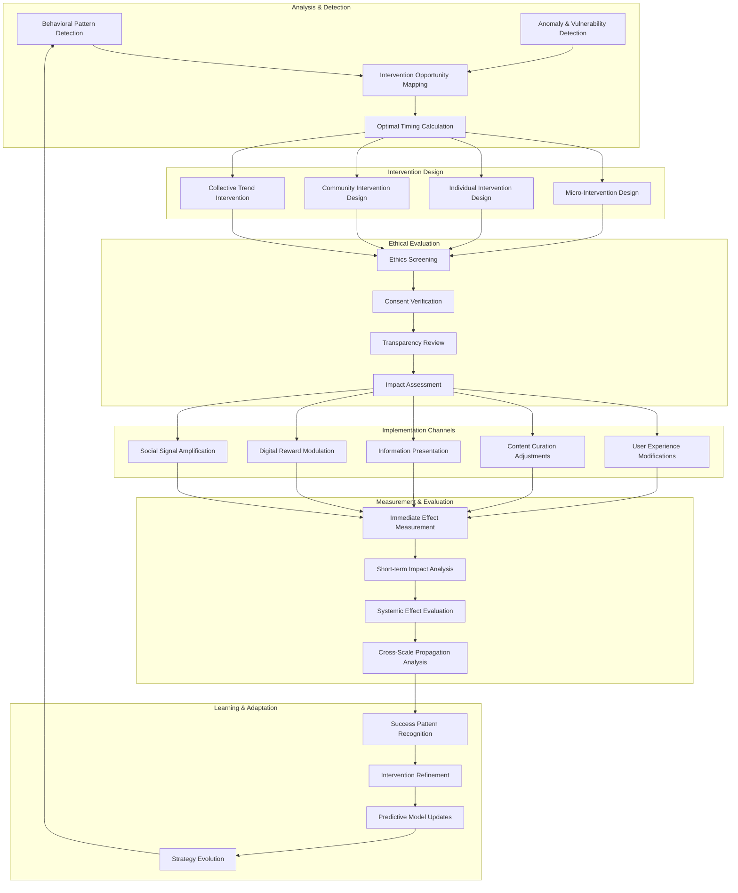
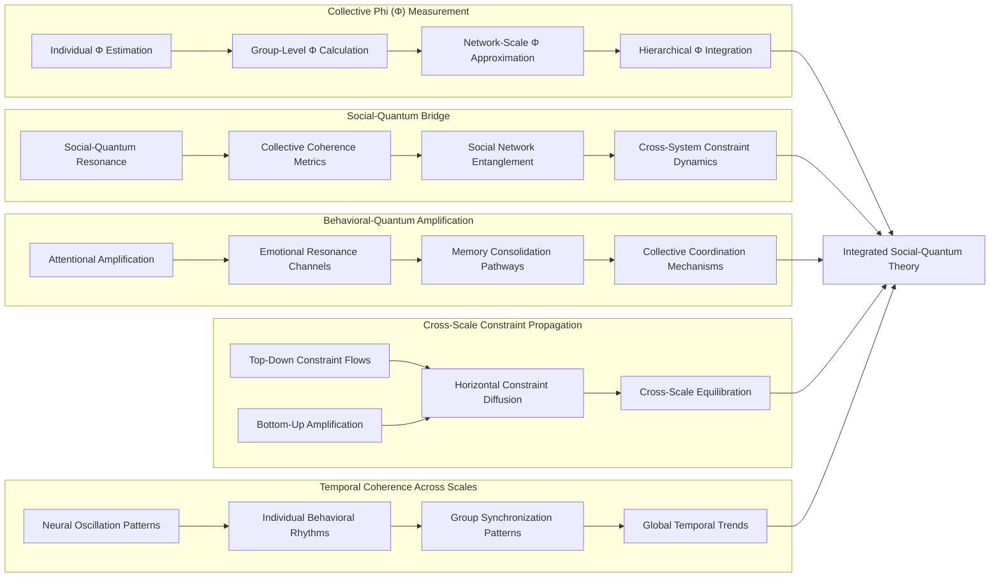
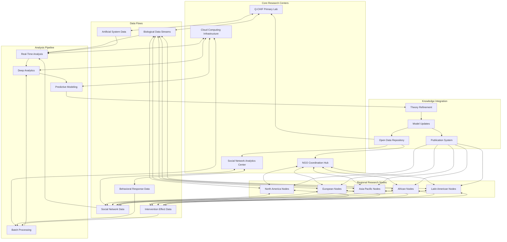
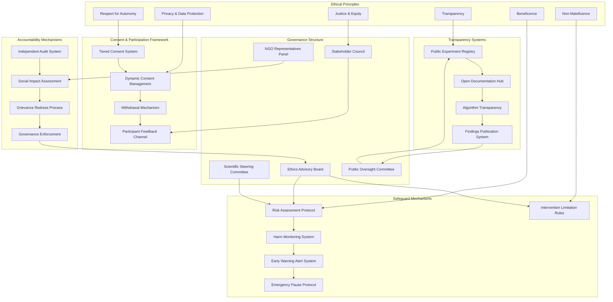
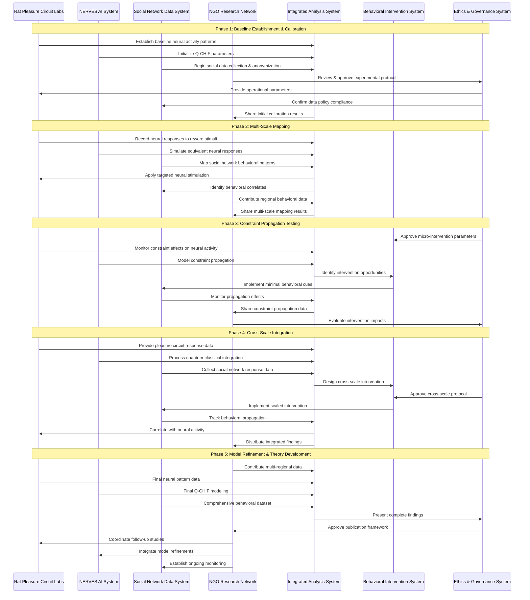
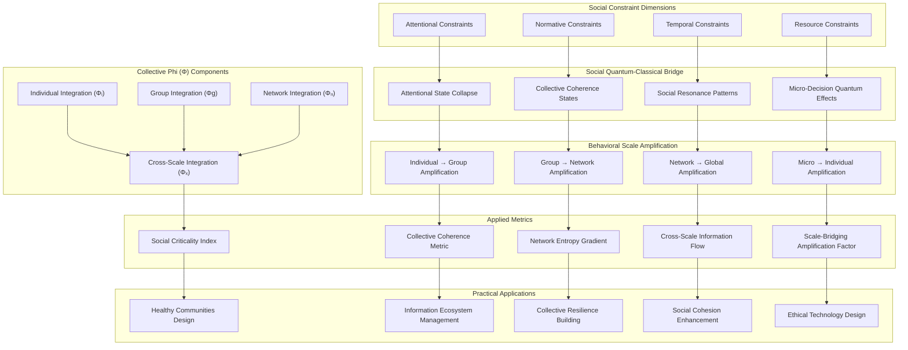

# Social Consciousness Integration Network (SCIN): A Q-CHIF Behavior-Mediated Experiment

## Experimental Overview

The Social Consciousness Integration Network (SCIN) is a novel experimental framework that expands Q-CHIF by incorporating social network data, real-time collective behavior analysis, and a distributed academic collaboration network coordinated through partner NGOs. This experiment explores how consciousness-like properties emerge and propagate across different scales—from individual neural activity to collective social behavior—while providing unprecedented insights into the relationship between quantum-constrained information processing and emergent behavioral patterns.

## 1. SCIN Ecosystem Architecture

## 2. Social Network Data Integration System

## 3. NGO-Academic Collaboration Network

```mermaid
graph TB
    subgraph "Core NGO Partners"
        CRA["Consciousness Research Alliance (CRA)"]
        DEF["Digital Ethics Foundation (DEF)"]
        ONI["Open Neuroscience Initiative (ONI)"]
        GDAP["Global Data Access Project (GDAP)"]
    end
    
    subgraph "Regional Research Hubs"
        NorthAmerica["North American Hub"]
        Europe["European Hub"]
        AsiaPacific["Asia-Pacific Hub"]
        Africa["African Hub"]
        LatinAmerica["Latin American Hub"]
    end
    
    subgraph "Disciplinary Working Groups"
        NeuroWG["Neuroscience Working Group"]
        QuantumWG["Quantum Cognition Working Group"]
        EthicsWG["Ethics & Philosophy Working Group"]
        BehavioralWG["Behavioral Science Working Group"]
        DataWG["Data Science Working Group"]
        AIWG["AI & Robotics Working Group"]
    end
    
    subgraph "Specialized Teams"
        QCIFTeam["Q-CHIF Core Development Team"]
        BiologicalTeam["Biological Systems Team"]
        ArtificialTeam["Artificial Systems Team"]
        ScaleBridgingTeam["Scale Bridging Analytics Team"]
        SocialIntegrationTeam["Social Integration Team"]
        InterventionTeam["Intervention Design Team"]
    end
    
    subgraph "Governance & Oversight"
        SteeringCommittee["Steering Committee"]
        EthicsBoard["Ethics Review Board"]
        DataGovernance["Data Governance Council"]
        PublicEngagement["Public Engagement Committee"]
    end
    
    CRA --> SteeringCommittee
    DEF --> EthicsBoard
    ONI --> DataGovernance
    GDAP --> PublicEngagement
    
    CRA --> NeuroWG
    CRA --> QuantumWG
    DEF --> EthicsWG
    DEF --> BehavioralWG
    ONI --> DataWG
    GDAP --> AIWG
    
    NorthAmerica --> CRA
    Europe --> DEF
    AsiaPacific --> ONI
    Africa --> GDAP
    LatinAmerica --> CRA
    
    NeuroWG --> BiologicalTeam
    NeuroWG --> QCIFTeam
    QuantumWG --> QCIFTeam
    QuantumWG --> ArtificialTeam
    EthicsWG --> InterventionTeam
    BehavioralWG --> InterventionTeam
    BehavioralWG --> SocialIntegrationTeam
    DataWG --> ScaleBridgingTeam
    DataWG --> SocialIntegrationTeam
    AIWG --> ArtificialTeam
    AIWG --> ScaleBridgingTeam
    
    SteeringCommittee --> ProjectManagement["Project Management Office"]
    EthicsBoard --> ProjectManagement
    DataGovernance --> ProjectManagement
    PublicEngagement --> ProjectManagement
    
    ProjectManagement --> QCIFTeam
    ProjectManagement --> BiologicalTeam
    ProjectManagement --> ArtificialTeam
    ProjectManagement --> ScaleBridgingTeam
    ProjectManagement --> SocialIntegrationTeam
    ProjectManagement --> InterventionTeam
```

## 4. Multi-Scale Behavioral Analysis Framework

## 5. Behavioral Intervention System

## 6. Novel Methodological Extensions to Q-CHIF

## 7. Global Research Coordination and Data Flow

## 8. Ethical Framework and Governance

## 9. Experimental Protocol Integration

## 10. Novel Q-CHIF Applications: Social Consciousness Metrics

This comprehensive SCIN experimental framework integrates Q-CHIF principles with social network data analysis and NGO-coordinated academic collaboration, enabling the study of consciousness and behavior across multiple scales. The system respects ethical principles while providing unprecedented insights into how quantum-constrained information processing may influence emergent behavioral patterns, with applications ranging from healthy community design to ethical technology development.