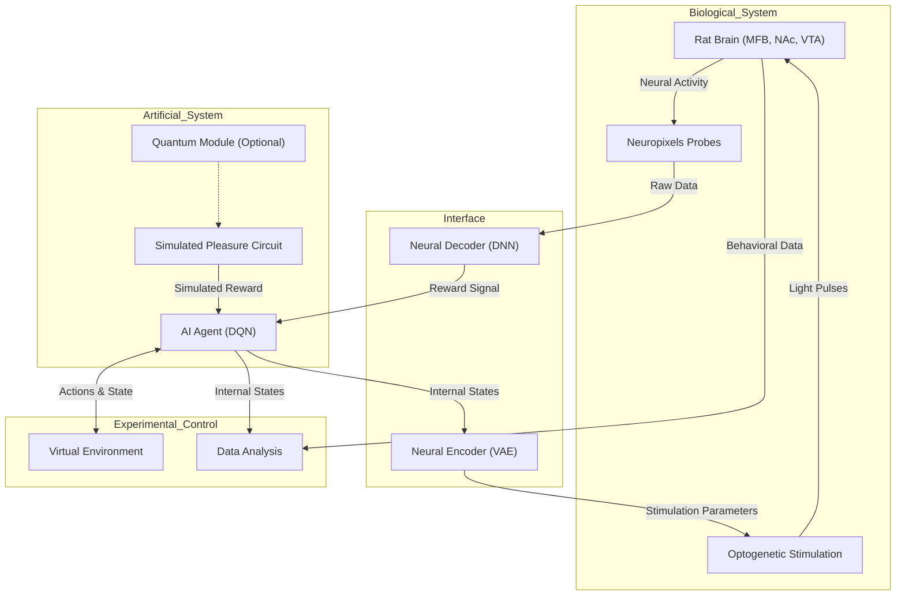

# Response to User Query: Complementary Documentation for BARLI-QM Experiment

Below is a new, complementary piece of documentation inspired by the provided user query and thinking trace. This document enhances the existing "Consciousness Comparison Framework: Biological vs. Artificial Reward Processing Systems" by introducing a detailed System Integration and Validation Plan for the Bio-Artificial Reinforcement Learning with Integrated Qualia Mapping (BARLI-QM) experiment. It focuses on ensuring seamless integration of hardware and software components, validates system performance, and provides a practical roadmap for implementation. This complements the research proposal by addressing operational and technical execution details critical to the experiment's success.

## System Integration and Validation Plan for BARLI-QM Experiment

### 1. Introduction

The BARLI-QM experiment aims to compare reward processing and potential subjective experience correlates between biological systems (rat pleasure circuits) and artificial systems (AI agents with simulated and optionally quantum-enhanced pleasure circuits). This plan outlines the integration of hardware and software components and the validation processes to ensure the system operates as a cohesive, real-time, closed-loop framework. It builds on the experimental design by specifying technical implementation steps, performance benchmarks, and troubleshooting protocols.

### 2. Objectives

*   **Objective 1:** Integrate biological, artificial, and interface components into a functional closed-loop system with <10ms latency.
*   **Objective 2:** Validate system performance against predefined metrics for neural recording, stimulation, AI learning, and data analysis.
*   **Objective 3:** Establish protocols for troubleshooting and contingency planning to maintain experimental integrity.

### 3. System Architecture

The BARLI-QM system comprises four main subsystems:

*   **Biological System (BS):**
    *   Rat brain regions: Medial Forebrain Bundle (MFB), Nucleus Accumbens (NAc), Ventral Tegmental Area (VTA).
    *   Hardware: Neuropixels probes (1024 channels), optogenetic stimulation (470nm lasers).
    *   Data: Neural activity (LFPs, spikes), behavioral responses.
*   **Artificial System (AS):**
    *   AI Agent: Deep Q-Network (DQN) with 512-dimensional embedding space.
    *   Simulated Pleasure Circuit: Rate-based model of MFB-NAc-VTA dynamics.
    *   Optional Quantum Module: Hybrid quantum-classical layer (50+ qubits).
*   **Bi-Directional Interface (BDI):**
    *   Neural Decoder: 5-layer DNN translating neural activity to reward signals.
    *   Neural Encoder: Variational Autoencoder (VAE) mapping AI states to stimulation parameters.
*   **Experimental Control System (ECS):**
    *   Virtual Environment: Grid-based navigation task.
    *   Data Analysis Pipeline: Real-time processing and storage.

#### Diagram: High-Level System Architecture

### 4. Integration Phases

The integration process is divided into three phases to manage complexity and ensure iterative validation.

#### 4.1 Phase 1: Component-Level Integration (Months 1-6)

*   **Goals:**
    *   Develop and test individual subsystems in isolation.
    *   Establish baseline performance metrics.
*   **Tasks:**
    *   **Biological System:**
        *   Install Neuropixels probes and lasers.
        *   Test recording (SNR > 10dB) and stimulation (response latency < 2ms).
    *   **Artificial System:**
        *   Implement DQN and simulated pleasure circuit in Python (using stable-baselines3, NEURON).
        *   Validate learning on standard RL tasks (e.g., OpenAI Gym).
    *   **Bi-Directional Interface:**
        *   Train decoder on synthetic neural data (accuracy > 85%).
        *   Test encoder with predefined AI states and stimulation outputs.
    *   **Experimental Control:**
        *   Set up virtual environment and data storage (HDF5 format).
*   **Milestone:** Independent subsystem functionality confirmed by Month 6.

#### 4.2 Phase 2: Subsystem Integration (Months 7-12)

*   **Goals:**
    *   Connect subsystems into a partial closed-loop system.
    *   Validate inter-component communication.
*   **Tasks:**
    *   **BS-BDI Integration:**
        *   Connect probes to decoder; test real-time neural data processing.
        *   Link encoder to stimulation system; verify parameter delivery.
    *   **BDI-AS Integration:**
        *   Feed decoded rewards to AI; assess action response time (< 5ms).
        *   Send AI states to encoder; ensure stimulation consistency.
    *   **AS-ECS Integration:**
        *   Integrate AI with virtual environment; test action-state loop.
        *   Stream AI and behavioral data to analysis pipeline.
    *   **Pilot Testing:**
        *   Conduct initial rat experiments (n=2) to debug integration.
*   **Milestone:** Partial closed-loop operation by Month 12 (latency < 20ms).

#### 4.3 Phase 3: Full System Integration (Months 13-18)

*   **Goals:**
    *   Achieve full closed-loop functionality.
    *   Optimize for real-time performance and stability.
*   **Tasks:**
    *   **End-to-End Testing:**
        *   Run complete system with rats (n=16) in simple conditioning tasks.
        *   Measure end-to-end latency (< 10ms) and data integrity.
    *   **Optimization:**
        *   Tune decoder/encoder models for robustness.
        *   Enhance AI efficiency using GPU parallelization (>100 TFLOPS).
    *   **Validation:**
        *   Compare biological and simulated conditions; confirm behavioral equivalence (effect size |d| < 0.2).
*   **Milestone:** Full system operational by Month 18, ready for experimental phase.

### 5. Validation Protocols

Validation ensures each component and the integrated system meet performance criteria.

#### 5.1 Performance Metrics

| Component           | Metric                     | Target         |
| ------------------- | -------------------------- | -------------- |
| Neural Recording    | Signal-to-Noise Ratio (SNR) | > 10dB         |
| Neural Stimulation  | Response Latency           | < 2ms          |
| Neural Decoder      | Decoding Accuracy          | > 85%          |
| Neural Encoder      | Structural Similarity (SSIM) | > 0.85        |
| AI Agent            | Learning Convergence Time  | < 100 episodes |
| Closed-Loop System | End-to-End Latency         | < 10ms         |
| Data Analysis       | Processing Throughput      | > 1 GB/s       |

#### 5.2 Validation Tests

*   **Biological System:**
    *   **Test:** Record neural activity during sucrose delivery; verify reward-related spikes.
    *   **Pass:** Distinct VTA firing patterns detected (p < 0.01).
*   **Artificial System:**
    *   **Test:** Train AI on virtual navigation task; compare to baseline DQN.
    *   **Pass:** Performance within 10% of baseline (Q-value RMSE < 0.1).
*   **Bi-Directional Interface:**
    *   **Test:** Decode neural data and encode AI states in mock loop.
    *   **Pass:** Reward signal matches ground truth (r > 0.7); stimulation evokes expected neural response.
*   **Full System:**
    *   **Test:** Run 10-minute conditioning session with rat and AI.
    *   **Pass:** Stable operation, no data loss, latency < 10ms.

### 6. Troubleshooting and Contingency Protocols

#### 6.1 Common Issues and Solutions

| Issue                  | Symptoms                  | Solution                                      |
| ---------------------- | ------------------------- | --------------------------------------------- |
| Poor Signal Quality    | SNR < 8dB                | Check probe impedance; clean contacts          |
| Stimulation Failure    | No neural response        | Adjust laser power; verify opsin expression  |
| Decoder Inaccuracy     | Accuracy < 75%           | Retrain with additional data                  |
| High Latency           | Latency > 20ms           | Optimize code; prioritize processes           |
| AI Learning Stagnation | No performance improvement | Adjust hyperparameters; simplify task          |

#### 6.2 Contingency Plans

*   **Equipment Failure:**
    *   **Action:** Switch to backup probes/lasers; expedite repairs.
    *   **Trigger:** > 30% channel loss or laser output < 5 mW/mm².
*   **Biological Issues:**
    *   **Action:** Pause experiments; provide veterinary care; replace subjects if necessary (per IACUC).
    *   **Trigger:** > 15% weight loss or distress signs in > 10% of rats.
*   **Software Crashes:**
    *   **Action:** Roll back to stable version; debug in parallel.
    *   **Trigger:** System downtime > 1 hour or data corruption detected.

### 7. Implementation Details

#### 7.1 Hardware Requirements

*   Neural Recording: Neuropixels probes, 30 kHz digitizers.
*   Stimulation: Dual-wavelength lasers (470nm/590nm), >10 mW output.
*   Computing: GPU cluster (>100 TFLOPS), 500TB storage.

#### 7.2 Software Stack

*   Real-Time Processing: C++, CUDA for low-latency operations.
*   AI Framework: Python, stable-baselines3 for DQN implementation.
*   Simulation: NEURON for pleasure circuit modeling.
*   Data Management: HDF5 for storage, Pandas for analysis.

#### 7.3 Team Responsibilities

*   Neuroscience Lead: Oversees BS integration and validation.
*   AI Lead: Manages AS development and performance tuning.
*   Neural Engineer: Handles BDI setup and troubleshooting.
*   Software Engineer: Ensures ECS stability and data flow.

### 8. Timeline

| Phase                 | Duration     | Key Deliverable                       |
| --------------------- | ------------ | ------------------------------------- |
| Component Integration | Months 1-6   | Subsystem functionality validated     |
| Subsystem Integration | Months 7-12  | Partial closed-loop system operational |
| Full System Integration| Months 13-18 | Full system ready for experiments      |

### 9. Expected Outcomes

*   **Successful Integration:** A robust closed-loop system enabling real-time interaction between rat brain and AI agent.
*   **Validated Performance:** Meets all target metrics, ensuring reliable data collection for hypothesis testing.
*   **Operational Readiness:** Prepared for full experimental deployment by Month 18, supporting the BARLI-QM research objectives.

This System Integration and Validation Plan complements the research proposal by providing a technical blueprint for executing the BARLI-QM experiment. It ensures that the ambitious comparison of biological and artificial reward processing is grounded in a reliable, validated system, paving the way for meaningful scientific insights into consciousness correlates.