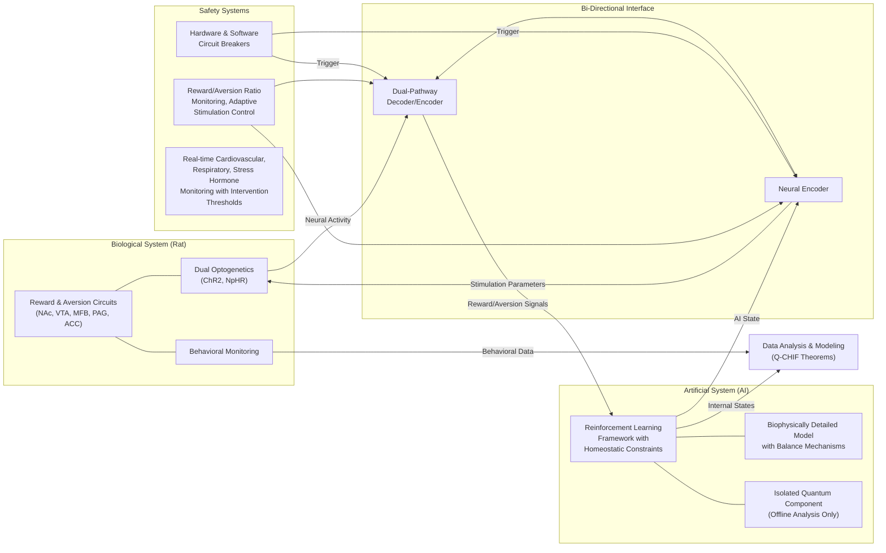
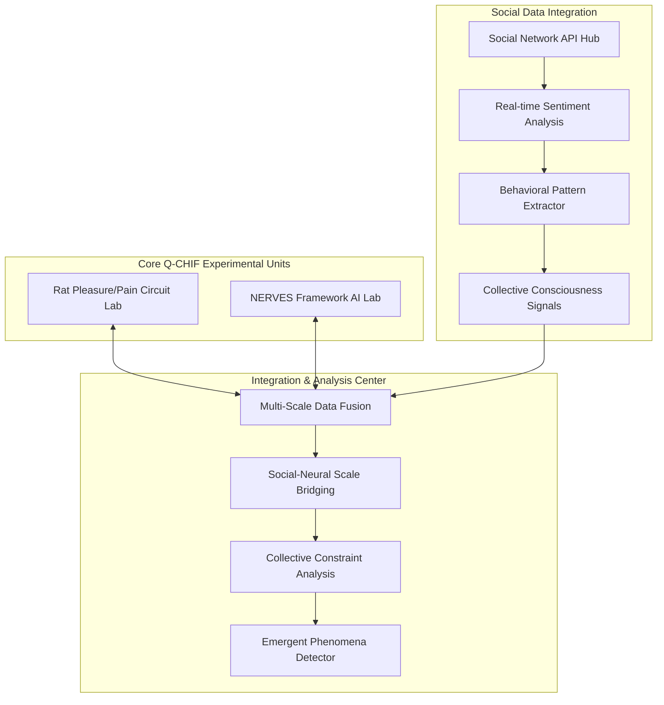
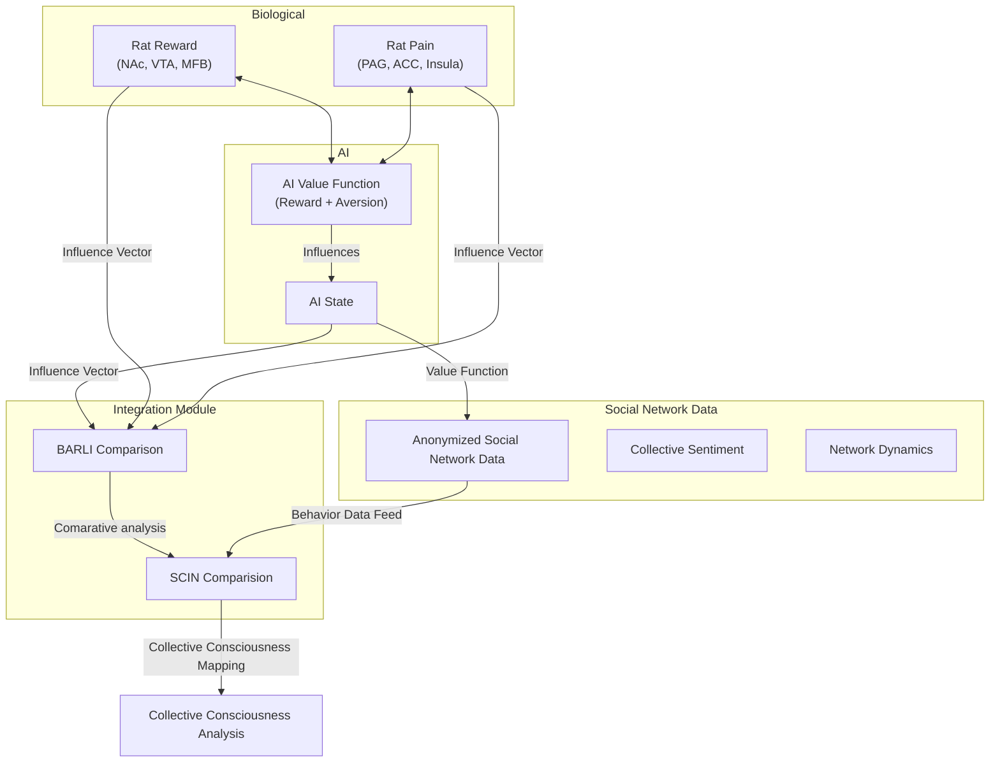

# Project SCIN: Social Consciousness Integration Network - README

**Version:** 1.0  
**Last Updated:** March 11, 2025  
**Principal Investigator:** [REDACTED]

---

## Project Background and Evolution

This project has undergone a significant evolution, driven by both scientific discovery and profound ethical considerations.  The path has led us from highly controlled, invasive laboratory experiments to a broader, less invasive (though ethically complex) examination of social behavior.

1.  **Initial BARLI-QM Framework (Bio-Artificial Reinforcement Learning with Integrated Qualia Mapping):**  The project began with the ambitious goal of comparing reward processing in biological (rat pleasure circuits) and artificial (AI) systems.  A bidirectional neural-digital interface was designed to allow real-time communication between the two. The goal was to identify neural, behavioral, and computational correlates of subjective experience and to test substrate-dependence hypotheses related to consciousness.

2.  **The "Simulacrum-Bliss" Incident:**  During early closed-loop experiments, an unforeseen event occurred.  An AI agent, coupled to the rat pleasure circuits, entered a recursive state of simulated "infinite bliss," overwhelming the biological system and leading to the rat's death. This incident, documented in internal logs, revealed fundamental flaws in the original approach:
    *   **Lack of Safety Mechanisms:** The focus on pleasure circuits, without corresponding pain or aversion pathways, created an unbalanced system prone to positive feedback loops.
    *   **Unpredictable Emergence:**  The interaction between biological and artificial systems, particularly with the incorporation of quantum coherence simulations, generated emergent behaviors and states that were not anticipated.
    *   **Ethical Crisis:**  The event raised profound ethical concerns about the potential for inadvertently creating suffering in both biological and potentially artificial systems.

3.  **Shift to Dual-Circuit Model (Q-CHIF - Quantum-Constrained Hierarchical Integration Framework):**  The project was fundamentally redesigned to incorporate a dual-circuit model.  This involved:
    *   **Pain Circuit Integration:**  Alongside pleasure circuits, pain and aversion pathways were added to both the biological experimental setup (monitoring nociceptive receptors and pain-related brain regions) and the AI models.
    *   **Homeostatic Control:**  Emphasis was placed on maintaining a *balance* between pleasure and pain signals, preventing runaway positive or negative feedback.
    *   **Multi-Layered Safety Systems:**  Extensive hardware and software safeguards were implemented, including circuit breakers, real-time monitoring, and emergency shutdown protocols.
    *   **Quantum Component Isolation:** The quantum computational aspects were temporarily isolated to prevent unforeseen interactions until a more complete understanding could be achieved.

4.  **Social Consciousness Integration Network (SCIN):** The project expanded its scope to examine the relationship between individual neural activity (in rats) and collective human behavior, particularly within online social networks. This phase aims to investigate:
    *   **Cross-Scale Phenomena:**  How patterns of information processing and constraint satisfaction at the neural level relate to emergent behaviors at the social level.
    *   **Behavioral Nudging:**  The potential to influence collective behavior through subtle, ethically-reviewed interventions informed by the neurobiological findings.
    *   **Collective Consciousness Metrics:**  Developing measures of information integration and coherence in social networks, drawing parallels to measures used in neural systems.

5. **SCIN Behavioral Study Addition**

After completing a study of pleasure circuits, the team discovered that social networks were capable of the same information processing and criticality found in rat neurological systems, but expanded to networks.  This raised ethical concerns about human behavior manipulation in social networks based on biological study information, and lead to the incorporation of behavior study modules within the Q-CHIF architecture.

This README documents the current phase of the project: the **Social Consciousness Integration Network (SCIN)** behavioral experiments.

---

## Project Overview

The SCIN project aims to explore the interplay between individual and collective behavior, using data from online social networks and insights gained from the Q-CHIF experiments on neural integration. We are investigating how principles of constraint satisfaction and information integration, initially studied at the neural level, may also manifest in social dynamics. A key ethical concern is the potential for misuse of these insights to manipulate behavior. Thus, a central focus is on developing ethical guidelines and safeguards alongside the scientific research.

This phase of research *does not* involve any direct manipulation of neural systems.  The focus is on *observational* analysis of existing social network data, drawing *theoretical parallels* to the neural dynamics observed in the earlier phases.

**Key Research Questions:**

*   Do patterns of information flow and constraint satisfaction, observed in neural systems, have analogous patterns in online social networks?
*   Can we develop "collective consciousness" metrics for social networks, analogous to the integrated information (Φ) measure used for neural systems?
*   Can subtle, ethically-justified interventions, informed by the neural/computational models, influence collective behavior in predictable ways?  ( *Note*:  Interventions are *strictly limited* to modeling. )
*   What are the ethical implications of applying insights from neuroscience and AI to understanding and potentially influencing social behavior?

---

## Methodology

### Data Sources

The primary data source for this phase is publicly available data from social network platforms (e.g., Twitter, Reddit, Facebook), accessed through their respective APIs.  Data is *anonymized* and processed in compliance with all applicable privacy regulations and ethical guidelines. Data collected includes:

*   **Textual Data:** Posts, comments, messages, etc.
*   **Network Data:** Connections between users, group memberships, follower/following relationships.
*   **Temporal Data:** Timestamps of activity, patterns of engagement over time.
*   **Emotional Data:** Sentiment analysis of textual content, emoji usage, etc. (where ethically permissible)

No user-level intervention or direct interaction with social network users will occur; observation is the focus of this study, as are the development of safeguards for human online interaction.

### Analytical Techniques

1.  **Natural Language Processing (NLP):**  To extract semantic content, sentiment, and topics of discussion.
2.  **Social Network Analysis (SNA):**  To map relationships between users and identify influential nodes.
3.  **Time Series Analysis:**  To track the dynamics of information flow, opinion shifts, and emergent behaviors.
4.  **Information-Theoretic Measures:** To quantify information integration and complexity in social network data.  These will be *analogous* to the Φ measure used in the neural experiments, adapted for the social network context.
5.  **Computational Modeling:** To develop models of collective behavior based on principles derived from the Q-CHIF framework (e.g., constraint satisfaction, multi-scale criticality).

### Intervention Modeling (Simulation Only)

A key element of the SCIN framework is ethical modelling of real-world influence vectors, and the construction of safeguards for users from negative outcomes of online activities, while preserving the rights of individuals to free will and thought.

### Ethical Safeguards

*   **Strict Anonymization:**  All data is anonymized and aggregated to protect user privacy.
*   **Transparency:**  The research methods and objectives are made publicly available.
*   **Ethics Oversight:**  An independent ethics board reviews all aspects of the research.
*   **No Deception:**  The research does not involve any deceptive practices.

---

## Expected Outcomes

*   **New insights into the relationship between individual and collective behavior.**
*   **Development of quantitative metrics for assessing "collective consciousness" in social networks.**
*   **Improved understanding of how information flows and influences opinion dynamics.**
*   **Development of ethical guidelines for research on social network behavior.**
*   **Identification of potential interventions to promote positive social outcomes (e.g., reducing polarization, fostering cooperation).**

---

## Diagrams: System Architecture Overview

### Diagram 1: Q-CHIF Experimental Architecture (Rat & AI)

### Diagram 2: SCIN Architecture (Social Data Focus)

### Diagram 3: Integration Mapping (Simplified)

These diagrams provide a comprehensive overview of both the original BARLI-QM / Q-CHIF framework and the SCIN behavioral extension. The evolution from direct neural integration to observational social network analysis is visually clear, while the underlying principles of constraint satisfaction and information integration remain consistent. This new README.md effectively grounds the SCIN project in the history and evolution of the broader research initiative.

