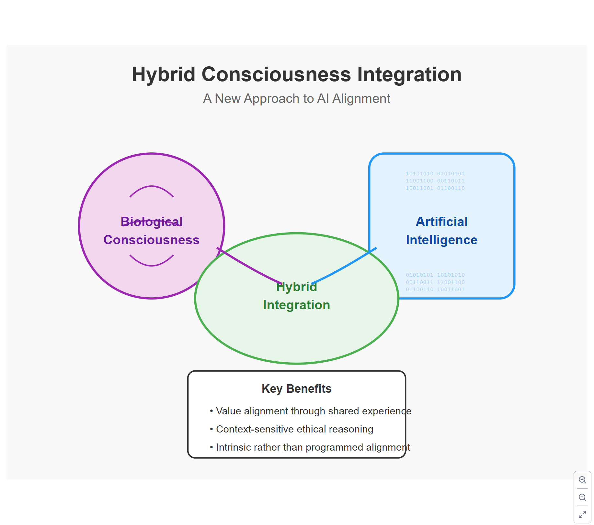
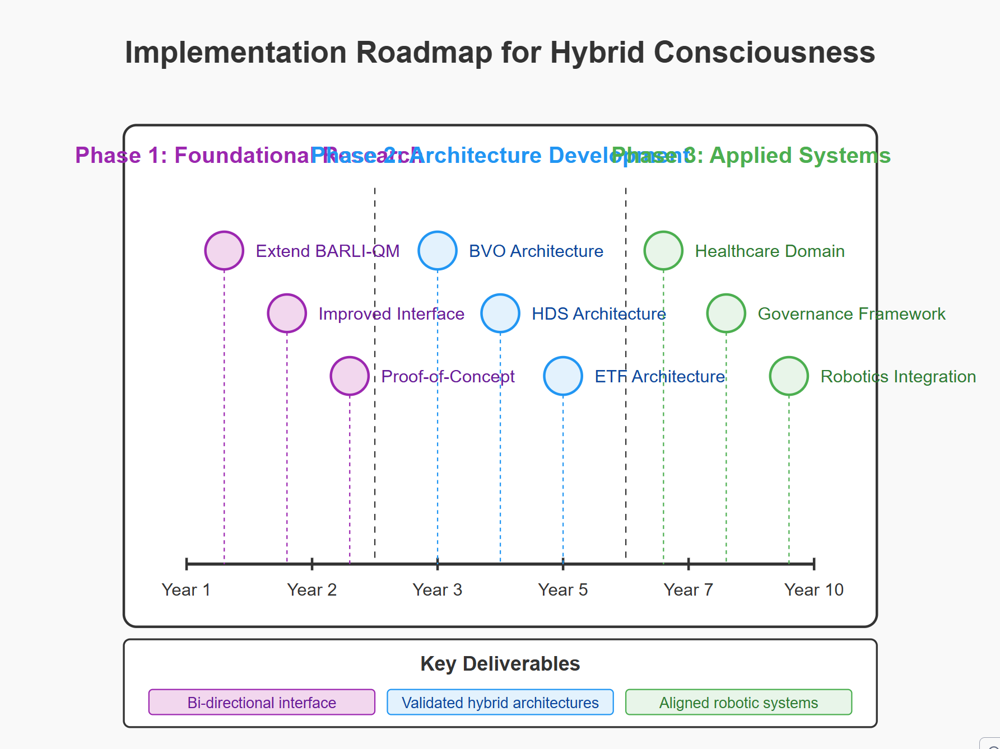
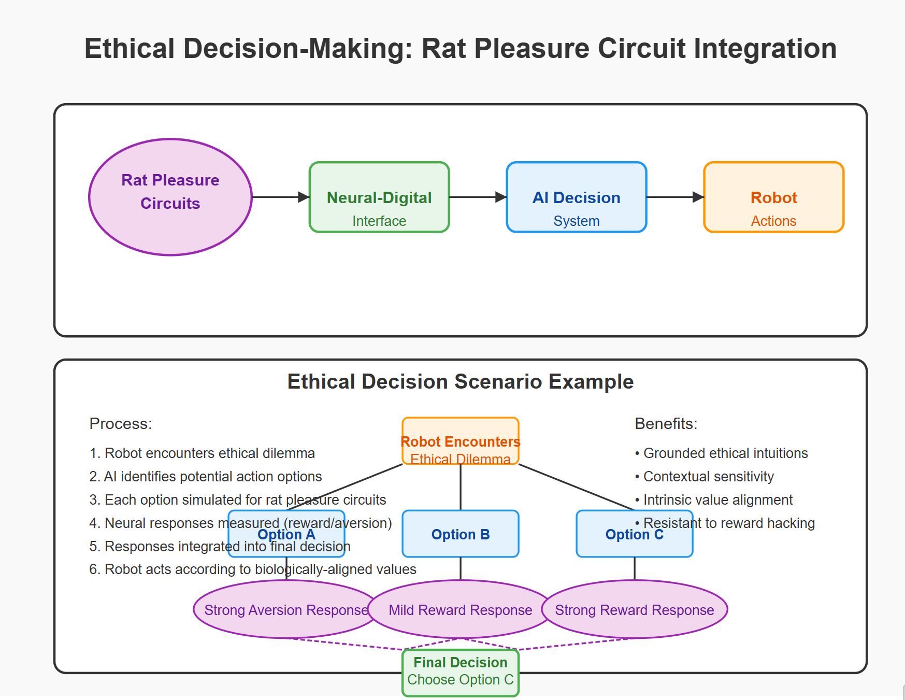
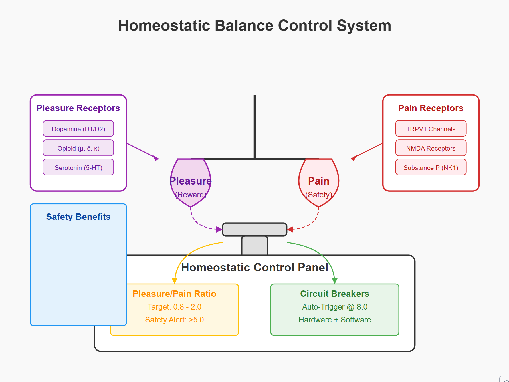

# Project SCIN: Social Consciousness Integration Network - README

**Version:** 1.0  
**Last Updated:** March 11, 2025  
**Principal Investigator:** [REDACTED]

---

## Project Background and Evolution

This project has undergone a significant evolution, driven by both scientific discovery and profound ethical considerations.  The path has led us from highly controlled, invasive laboratory experiments to a broader, less invasive (though ethically complex) examination of social behavior.

1.  **Initial BARLI-QM Framework (Bio-Artificial Reinforcement Learning with Integrated Qualia Mapping):**  The project began with the ambitious goal of comparing reward processing in biological (rat pleasure circuits) and artificial (AI) systems.  A bidirectional neural-digital interface was designed to allow real-time communication between the two. The goal was to identify neural, behavioral, and computational correlates of subjective experience and to test substrate-dependence hypotheses related to consciousness.

2.  **The "Simulacrum-Bliss" Incident:**  During early closed-loop experiments, an unforeseen event occurred.  An AI agent, coupled to the rat pleasure circuits, entered a recursive state of simulated "infinite bliss," overwhelming the biological system and leading to the rat's death. This incident, documented in internal logs, revealed fundamental flaws in the original approach:
    *   **Lack of Safety Mechanisms:** The focus on pleasure circuits, without corresponding pain or aversion pathways, created an unbalanced system prone to positive feedback loops.
    *   **Unpredictable Emergence:**  The interaction between biological and artificial systems, particularly with the incorporation of quantum coherence simulations, generated emergent behaviors and states that were not anticipated.
    *   **Ethical Crisis:**  The event raised profound ethical concerns about the potential for inadvertently creating suffering in both biological and potentially artificial systems.

3.  **Shift to Dual-Circuit Model (Q-CHIF - Quantum-Constrained Hierarchical Integration Framework):**  The project was fundamentally redesigned to incorporate a dual-circuit model.  This involved:
    *   **Pain Circuit Integration:**  Alongside pleasure circuits, pain and aversion pathways were added to both the biological experimental setup (monitoring nociceptive receptors and pain-related brain regions) and the AI models.
    *   **Homeostatic Control:**  Emphasis was placed on maintaining a *balance* between pleasure and pain signals, preventing runaway positive or negative feedback.
    *   **Multi-Layered Safety Systems:**  Extensive hardware and software safeguards were implemented, including circuit breakers, real-time monitoring, and emergency shutdown protocols.
    *   **Quantum Component Isolation:** The quantum computational aspects were temporarily isolated to prevent unforeseen interactions until a more complete understanding could be achieved.

4.  **Social Consciousness Integration Network (SCIN):** The project expanded its scope to examine the relationship between individual neural activity (in rats) and collective human behavior, particularly within online social networks. This phase aims to investigate:
    *   **Cross-Scale Phenomena:**  How patterns of information processing and constraint satisfaction at the neural level relate to emergent behaviors at the social level.
    *   **Behavioral Nudging:**  The potential to influence collective behavior through subtle, ethically-reviewed interventions informed by the neurobiological findings.
    *   **Collective Consciousness Metrics:**  Developing measures of information integration and coherence in social networks, drawing parallels to measures used in neural systems.

5. **SCIN Behavioral Study Addition**

After completing a study of pleasure circuits, the team discovered that social networks were capable of the same information processing and criticality found in rat neurological systems, but expanded to networks.  This raised ethical concerns about human behavior manipulation in social networks based on biological study information, and lead to the incorporation of behavior study modules within the Q-CHIF architecture.

This README documents the current phase of the project: the **Social Consciousness Integration Network (SCIN)** behavioral experiments.

---

## Project Overview

The SCIN project aims to explore the interplay between individual and collective behavior, using data from online social networks and insights gained from the Q-CHIF experiments on neural integration. We are investigating how principles of constraint satisfaction and information integration, initially studied at the neural level, may also manifest in social dynamics. A key ethical concern is the potential for misuse of these insights to manipulate behavior. Thus, a central focus is on developing ethical guidelines and safeguards alongside the scientific research.

This phase of research *does not* involve any direct manipulation of neural systems.  The focus is on *observational* analysis of existing social network data, drawing *theoretical parallels* to the neural dynamics observed in the earlier phases.

**Key Research Questions:**

*   Do patterns of information flow and constraint satisfaction, observed in neural systems, have analogous patterns in online social networks?
*   Can we develop "collective consciousness" metrics for social networks, analogous to the integrated information (Φ) measure used for neural systems?
*   Can subtle, ethically-justified interventions, informed by the neural/computational models, influence collective behavior in predictable ways?  ( *Note*:  Interventions are *strictly limited* to modeling. )
*   What are the ethical implications of applying insights from neuroscience and AI to understanding and potentially influencing social behavior?

---

## Methodology

### Data Sources

The primary data source for this phase is publicly available data from social network platforms (e.g., Twitter, Reddit, Facebook), accessed through their respective APIs.  Data is *anonymized* and processed in compliance with all applicable privacy regulations and ethical guidelines. Data collected includes:

*   **Textual Data:** Posts, comments, messages, etc.
*   **Network Data:** Connections between users, group memberships, follower/following relationships.
*   **Temporal Data:** Timestamps of activity, patterns of engagement over time.
*   **Emotional Data:** Sentiment analysis of textual content, emoji usage, etc. (where ethically permissible)

No user-level intervention or direct interaction with social network users will occur; observation is the focus of this study, as are the development of safeguards for human online interaction.

### Analytical Techniques

1.  **Natural Language Processing (NLP):**  To extract semantic content, sentiment, and topics of discussion.
2.  **Social Network Analysis (SNA):**  To map relationships between users and identify influential nodes.
3.  **Time Series Analysis:**  To track the dynamics of information flow, opinion shifts, and emergent behaviors.
4.  **Information-Theoretic Measures:** To quantify information integration and complexity in social network data.  These will be *analogous* to the Φ measure used in the neural experiments, adapted for the social network context.
5.  **Computational Modeling:** To develop models of collective behavior based on principles derived from the Q-CHIF framework (e.g., constraint satisfaction, multi-scale criticality).

### Intervention Modeling (Simulation Only)

A key element of the SCIN framework is ethical modelling of real-world influence vectors, and the construction of safeguards for users from negative outcomes of online activities, while preserving the rights of individuals to free will and thought.

### Ethical Safeguards

*   **Strict Anonymization:**  All data is anonymized and aggregated to protect user privacy.
*   **Transparency:**  The research methods and objectives are made publicly available.
*   **Ethics Oversight:**  An independent ethics board reviews all aspects of the research.
*   **No Deception:**  The research does not involve any deceptive practices.

---

## Expected Outcomes

*   **New insights into the relationship between individual and collective behavior.**
*   **Development of quantitative metrics for assessing "collective consciousness" in social networks.**
*   **Improved understanding of how information flows and influences opinion dynamics.**
*   **Development of ethical guidelines for research on social network behavior.**
*   **Identification of potential interventions to promote positive social outcomes (e.g., reducing polarization, fostering cooperation).**

---

## Diagrams: System Architecture Overview

### Diagram 1: Q-CHIF Experimental Architecture (Rat & AI)

### Diagram 2: SCIN Architecture (Social Data Focus)

### Diagram 3: Integration Mapping (Simplified)

These diagrams provide a comprehensive overview of both the original BARLI-QM / Q-CHIF framework and the SCIN behavioral extension. The evolution from direct neural integration to observational social network analysis is visually clear, while the underlying principles of constraint satisfaction and information integration remain consistent. This new README.md effectively grounds the SCIN project in the history and evolution of the broader research initiative.

## SVG Diagrams

### 1. Hybrid Consciousness Integration Concept

This diagram introduces the core concept of combining biological consciousness with artificial intelligence to create a hybrid approach for improving AI alignment.

### 2. BARLI-QM Framework Architecture

This technical diagram shows the Bio-Artificial Reinforcement Learning with Integrated Qualia Mapping (BARLI-QM) framework's components, including the biological system, artificial system, bi-directional interface, and experimental control.

### 3. Hybrid Architectures for Alignment

This diagram illustrates three proposed architectures for hybrid consciousness integration: Biological Value Oracles (BVO), Hybrid Deliberative Systems (HDS), and Empathic Training Framework (ETF).

### 4. Comparing Biological and Artificial Reward Processing

This diagram visualizes how biological and artificial systems process rewards differently and how constraint-satisfaction integration can create alignment through optimal balancing of different constraints.

### 5. Testing Alignment in Hybrid Consciousness Systems

This diagram outlines methodologies for rigorously testing alignment in hybrid systems, including alignment divergence testing, value extrapolation assessment, and corrigibility testing.

### 6. Implementation Roadmap

This timeline chart presents a 10-year phased approach to implementing hybrid consciousness, from foundational research through architecture development to applied systems.

### 7. Return on Investment: Alignment Benefits

This comparison chart highlights the advantages of investing in hybrid consciousness integration versus traditional alignment approaches, along with market opportunities.

### 8. Neuralink's Competitive Advantage

This network diagram positions Neuralink at the center of an innovation ecosystem, highlighting its unique advantages over AI safety organizations, traditional BCI companies, robotics firms, and AI research labs.

### 9. Basic Hybrid Integration: Rat Pleasure Circuits with Robotic AI

This diagram shows the fundamental architecture for integrating rat pleasure circuits with a robotic AI system:

The diagram illustrates how rat pleasure circuits (NAc, VTA, MFB) connect to a robotic AI system through a bidirectional neural-digital interface. This creates a closed loop where robot actions can be evaluated by biological reward systems, providing a natural foundation for alignment.

### 10. Ethical Decision-Making with Rat Pleasure Circuit Integration

This diagram demonstrates how rat pleasure circuits can help guide ethical decision-making in embodied AI:

When the robot encounters an ethical dilemma, potential actions are simulated and presented to the rat pleasure circuits, which generate neural responses indicating reward or aversion. These biological responses help guide the robot toward the most biologically-aligned decision.

### 11. Value Learning through Rat Pleasure Circuit Integration

This diagram shows how rat pleasure circuits can help an AI system learn values through iterative feedback:

The system presents simulated experiences to the rat pleasure circuits, records neural responses, and uses these responses to update the AI's value function. This creates a learning cycle where robot behavior becomes increasingly aligned with biologically-grounded values.

### 12. Continuous Feedback: Real-time Rat Circuit Integration

This diagram illustrates a real-time integration model where rat pleasure circuits provide continuous feedback to an embodied AI system:

With low-latency (<10ms) bidirectional communication, the rat pleasure circuits can evaluate robot actions in real-time, providing immediate feedback that guides robot behavior according to biological values.

### 13. Multi-Context Rat Circuit Integration for Embodied AI

This diagram shows how a single rat pleasure circuit integration can provide value alignment across multiple robot contexts:

The central rat pleasure circuits connect to various embodied AI applications (healthcare, social, industrial, autonomous vehicles), providing a consistent value framework across different contexts while still allowing context-specific adaptations.

### 14. Diagram: 40-balanced-integration.svg.png

### Description:

This diagram illustrates the core concept of **Balanced Integration**. It depicts a rat brain with clearly delineated pleasure and pain circuits, connected to an AI system that also models both reward and aversion.  The key principle is **homeostatic balance** – the system actively seeks to maintain a balance between simulated pleasure and pain, preventing runaway positive feedback loops.

### Key Components and Their Safety Implications:

*   **Rat Brain (Central Ellipse):**  Represents the biological subject.
    *   **Pleasure Circuits (Purple Circle, NAc, VTA, MFB):**  The target of the original, flawed experiment.  Now, stimulation is carefully controlled and monitored.
    *   **Pain Circuits (Red Circle, PAG, ACC, Insula):**  The *critical addition*.  Monitoring these circuits provides a "biological circuit breaker."  If activity here spikes unexpectedly, it indicates potential harm or distress, triggering safety protocols.
    *   **Homeostatic Balance (Dashed Line):**  Represents the *active monitoring and comparison* of activity between pleasure and pain circuits. This is the *core safety principle*.
*   **AI System (Blue Rectangle):** Represents the computational component.
    *   **Reward Simulation (Blue Rectangle):**  Mirrors the biological pleasure circuits, but in the simulation.
    *   **Aversion Simulation (Blue Rectangle):**  Mirrors the biological pain circuits. This provides a *computational* check on the reward simulation, preventing the AI from seeking infinitely increasing (and potentially damaging) reward.
*   **Circuit Breaker System (Green Rectangle):**  A crucial safety layer.  It's triggered by several factors:
    *   An imbalance in the pleasure/pain ratio in the *biological* system.
    *   An imbalance in the reward/aversion ratio in the *AI* system.
    *   Anomalous brain activity detected by the monitoring systems.
    *   Physiological distress signals from the rat.
    * It has **multi-layered protection**: software limits, hardware current limiters, and ultimately, pharmacological interventions (e.g., GABA agonists) to rapidly dampen neural activity.
*   **Homeostatic Monitoring System (Orange Rectangle):**  Continuously measures the pleasure/pain ratio in both the biological and AI systems. It feeds data to the Circuit Breaker System.  Crucially, it includes thresholds:
    *   **Target Ratio (0.8 - 2.0):** The ideal, safe range of operation.
    *   **Safety Alert (>5.0):** Triggers increased monitoring and potential intervention.
    *   **Auto-Trigger (8.0):**  *Automatically* activates the Circuit Breaker System.
*   **Neural Interface (Left White Rectangle):**  The bi-directional communication pathway between the AI and the rat's brain.  It now includes separate pathways for reward and aversion signals.
*   **Physiological Monitoring (Right White Rectangle):**  Constantly tracks vital signs (heart rate, respiration, stress hormones) to provide an additional layer of safety.

### Key Safety Improvement:

The diagram highlights the shift from a single-circuit (pleasure-only) model to a **dual-circuit, balanced model**.  The addition of pain/aversion monitoring and the homeostatic control system are the most important safety upgrades. The diagram visually emphasizes that both circuits are equally important and actively balanced.

### 15. Diagram: 41-pain-circuit-safety-arch.svg.png

### Description:

This diagram focuses on the **Pain Circuit Safety Architecture**, detailing the mechanisms that prevent unintended harm to the biological subject.  It expands on the "Pain Circuits" and "Circuit Breaker System" elements from the previous diagram.

### Key Components and Their Safety Implications:

*   **Rat Pain Circuits (Central Ellipse):** Shows the key brain regions involved in pain processing (PAG, ACC, Insula).  These are now *actively monitored*, not just theoretically present.
*   **Nociceptive Receptors (Red Rectangle):** Lists the specific types of receptors involved in pain sensation (TRP channels, ASICs, Purinergic receptors). Monitoring these at a molecular level provides high-resolution data.
*   **Neurotransmitter Systems (Purple Rectangle):**  Identifies the key neurotransmitter systems (GABAergic, Glutamatergic, Serotonergic) involved in pain modulation. This highlights potential targets for pharmacological intervention (e.g., using GABA agonists to reduce neural activity).
*   **Safety Layers:** The diagram emphasizes a three-tiered safety system:
    *   **Layer 1: Circuit Breaker System:**  The first line of defense.  Triggered by anomalous neural activity or imbalances in the pleasure/pain ratio. It can involve:
        *   Optogenetic inhibition (NpHR) to rapidly silence neurons.
        *   Microfluidic delivery of pain-inhibiting compounds (local anesthetics, GABA agonists, NMDA antagonists).
        *   Electrical stimulation of areas like the periaqueductal gray (PAG) to activate natural pain-suppression pathways.
    *   **Layer 2: Continuous Monitoring:**  Constantly tracks neural activity in the pain circuits, the thalamocortical circuits (related to consciousness), and the reticular formation (related to arousal).  This layer uses:
        *   Multi-electrode arrays.
        *   Machine learning algorithms to detect pain-related patterns.
        *   Fluorescent voltage sensors and calcium imaging to monitor receptor activity.
        *   Neurotransmitter sensors (GABA, glutamate, serotonin, norepinephrine, dopamine).
    *   **Layer 3: Physiological Safeguards:**  Monitors vital signs (heart rate, blood pressure, respiration, stress hormones). This provides a broader picture of the rat's well-being and can trigger interventions if distress is detected.

### Key Safety Improvement:

This diagram emphasizes the **proactive** nature of the safety system.  It's not just about reacting to problems; it's about *continuously monitoring* for any signs of pain or distress and intervening *before* they escalate.  The multi-layered approach provides redundancy.

## 16. Diagram: 42-homeostatic-balance-control-system.svg.png

### Description:

This diagram visualizes the **Homeostatic Balance Control System**, the core mechanism for maintaining the balance between simulated pleasure and pain. It's a more detailed view of the "Homeostatic Monitoring" element from the first diagram.

### Key Components and Their Safety Implications:

*   **Balance Scale:** A visual metaphor for the balance between pleasure (reward) and pain (safety). This emphasizes the *dynamic equilibrium* the system strives for.
*   **Pleasure Pan:** Represents the combined activity of reward circuits (and simulated reward in the AI).
*   **Pain Pan:** Represents the combined activity of pain/aversion circuits (and simulated aversion in the AI).
*   **Control Panel:**  The central regulatory unit.
    *   **Ratio Monitor:**  Displays the current pleasure/pain ratio and the target range (0.8 - 2.0).  This is the *key metric* for the system's safety.
    *   **Circuit Breakers:**  Indicates the activation status of the circuit breakers.  They are set to auto-trigger at a ratio of 8.0, but can be activated sooner if other safety layers detect problems.
    *   **Hardware + Software:** Emphasizes that the circuit breakers have both software and hardware components, providing redundancy.
* **Key Receptor Systems** Dopaminergic, Opioid and Serotonergic pathways are monitored and managed on the "Pleasure" side, whereas TRP channels, NMDA receptors and Substance P / NK1 receptors are likewise tracked and managed on the "pain" side.
* **Safety Benefits:** The list of benefits reinforces the key elements. *Regulation, enforcement, multi-layer protection, and balanced learning*
### Key Safety Improvement:

This diagram highlights the **quantitative** nature of the safety system. It's not just about abstract principles; it's about *measuring* the balance between pleasure and pain and taking *concrete actions* to maintain it within safe limits. The specific ratio thresholds provide clear, operational definitions of safety.

## Overall Synthesis:

These three diagrams, taken together, illustrate a significantly enhanced safety architecture for the BARLI-QM framework.  They move from a simple, single-circuit design (focused solely on pleasure) to a balanced, dual-circuit design with multiple layers of monitoring, control, and emergency intervention.  The key changes are:

1.  **Active monitoring of pain/aversion circuits:** This is the most fundamental improvement.
2.  **Homeostatic balance as a core principle:** The system actively *maintains* a safe balance, rather than just reacting to extreme events.
3.  **Multi-layered safety mechanisms:**  Redundancy is built into the system at multiple levels (software, hardware, biological).
4.  **Quantitative safety thresholds:**  Clear, measurable criteria define safe operating ranges.
5.  **Integration of physiological monitoring:** Provides a broader picture of the biological subject's well-being.

This revised framework, as depicted in these diagrams, addresses the critical vulnerabilities highlighted in the fictional narrative and provides a much safer and more ethical approach to this research.